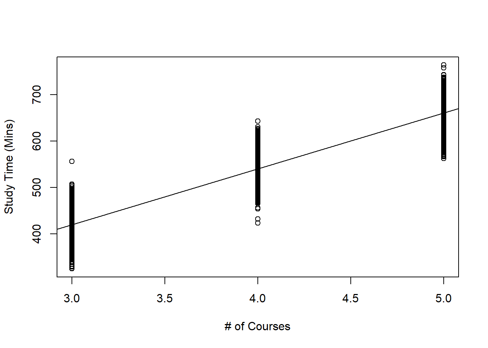
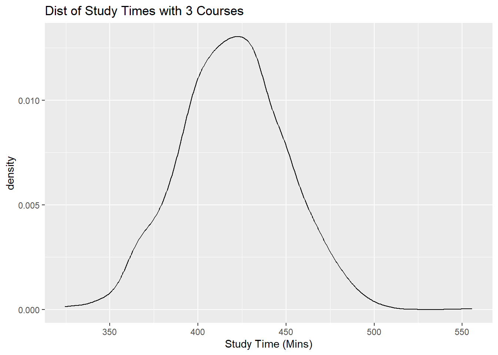

# Introduction to Simple Linear Regression


## Introduction

**Simple** linear regression is called simple because it concerns the study of only one predictor variable with one quantitative response variable. **Multiple** linear regression, which will be covered later, concerns the study of two or more predictor variables with one quantitative response variable.

For now, we'll only look at quantitative predictor variables.

Scatter plots are the most common way of visualizing the relationship between one quantitative predictor variable and one quantitative response variable. In example below, we have data from 6000 UVA Undergrad students on amount of time studying per week and number of courses taken in semester.

```{r eval=FALSE}
##create dataframe
df<-data.frame(study,courses)

##fit regression
result<-lm(study~courses, data=df)
```
```{r eval=FALSE}
##create scatterplot with regression line overlaid
plot(df$courses, df$study, xlab="# of Courses", ylab="Study Time (Mins)")
abline(result)
```

```{r scattercourses, echo=FALSE, fig.align='center',fig.cap="Scatterplot of Study Time vs. Number of Courses Taken"}

```


Questions may include:

* Are study time and number of courses taken related to one another?

* How strong is this relationship?

* Could we use the data to make a prediction for the study time of a student who is not in this scatterplot?

* How confident are we of the prediction?

Simple linear regression can help answer these questions.

**A Note**: _multiple_ linear regression refers to regressions of multiple predictor variables and _only one_ response variable. Whereas _multivariate_ regression also refers to multiple predictor variables and _multiple_ response variables.

So in review:

* multiple linear regression: >2 predictors, 1 response vars

* multivariate regression: >2 predictors, >2 response vars

### Basic Ideas with Statistics

#### Population vs. Sample

Statistical methods are usually used to make inferences about the **population** based on information from a **sample**.

* A sample is the collection of units that is actually measured or surveyed in a study.
* The population includes all units of interest.

In the study time example above, the population is all UVA Undergrads, while sample is the 6000 students that we have data on and are displayed on the scatter-plot.

#### Parameter vs. Statistic

* **Parameters** are numerical quantities that describe a population
* **Statistics** are numerical quantities that describe a sample

In the above example, a paramter would be the average study time among all undergrad students (called population mean), and example of statistic could be the average study time of the 6000 UVA students we have data on (called sample mean).

We rarely know the actual numerical value of a paramter, so we use the numerical value of the statistic to estimate the unknown numerical value corresponding to the parameter.

We also have different notation for parameters and statistics:

* population mean: $\mu$
* sample mean: $\bar{x}$

We say that $\bar{x}$ is an **estimator** of $\mu$.

Pay attention to whether a statistic (known variable) or parameter (unknown variable) is being described.

### Motivation

Linear regression models generally have two primary uses:

1. **Prediction**: Predict a future value of a response variable, using information from predictor variables.

2. **Association**: Quantify the relationship between variables. How does a change in the predictor variable change the value of the response variable?

We always distinguish between **response variable, denoted by _y_**, and a **predictor variable, denoted by _x_**. And that the response variable may be approximated by some mathematical function, denoted by _f_, of the predictor variable, i.e.

\begin{equation}
y\approx f(x)
\end{equation}

Often this is written as:

\begin{equation}
y = f(x) + \epsilon
\end{equation}

where $\epsilon$ **denotes a random error term**, with mean 0. The error term cannot be predicted based on the data we have.

There are various statistical methods to estimate _f_. Once we estimate _f_, we can use our method for prediction and or association.

Using the study time example:

* a prediction example: a student intends to take four courses this semester. What is this students predicted study time, on average?

* an association example: we want to see how taking more courses increases study time.

#### Practice Questions

Are we using a regression model for prediction or association?

1. It is early in the morning and I am heading out for the rest of the day. I want to know the weather forecast for the rest of the day so I know what to wear.

* Prediction

2. An exec for a sports league wants to assess how increasing the length of commercial breaks may impact enjoyment of sports fans who watch games on TV.

* Association

3. The Education Secretary would like to evaluate how certain factors such as use of technology in classrooms and investment in teacher training and teacher pay are associated with reading skills of students.

* Association

4. When buying a home, the prospective buyer would like to know if the home is under- or over- priced, given its characteristics.

* Prediction

## Simple Linear Regression (SLR)

In simple linear regression, the function _f_ that relates the predictor variable with the response variable is typically $\beta_0 + \beta_1 x$. Mathematically, we express this as:

\begin{equation}
y\approx \beta_0 + \beta_1 x
\end{equation}

or in other words, the response variable has an approximately linear relationship with the predictor variable.

In SLR, this relationship is more explicitly formulated as the **simple linear regression equation**:

\begin{equation}
E(y|x) = \beta_0 + \beta_1 x
(\#eq:slreq)
\end{equation}

* $\beta_0$ and $\beta_1$ are parameters of the SLR equation, and we want to estimate them.

* These parameters are called **regression coefficients**

* $\beta_1$ is called the slope, which denotes the change in _y_, on average, when _x_ increases by one unit.

* $\beta_0$ is called the intercept, denotes the average of _y_ when $x=0$.

* notation on left denotes the **expected** value of response variable, for a fixed value of the predictor variable. Equation \@ref(eq:slreq) implies that for each value of the predictor variable _x_, the expected value of the response variable _y_ is $\beta_0+\beta_1 x$. The expected value is also the population mean. Applying \@ref(eq:slreq) to our study time example, it implies that:

  * for students who take 3 courses, their expected study time is $\beta_0+3\beta_1 x$
  * 4 courses $\beta_0+4\beta_1 x$
  * 5 courses $\beta_0+5\beta_1 x$
  
So $f(x)=\beta_0+\beta_1 x$ gives us the value of the response variable for a specific value of the predictor variable. But for each predictor value, the value of the response is not constant. We say that for each value of _x_, the response variable _y_ has some variance. The variance of the response for each value of _x_ is the same as the variance of the error term, $\epsilon$. Thus we have the **simple linear regression model**:

\begin{equation}
=\beta_0+\beta_1 x + \epsilon
(\#eq:slrmodel)
\end{equation}

Need to make some assumptions for error term $\epsilon$. Generally, the assumptions are:

1. errors have a mean of 0

2. errors have variance denoted by $\sigma^2$, this variance is constant

3. Errors are independent

4. Errors are normally distributed

From \@ref(eq:slrmodel) notice we have another parameter, $\sigma^2$.

In module 5 we'll cover how to determine if these assumptions are met.

These assumptions mean that for each value of predictor variable _x_, response variable:

1. follows normal distribution

2. has mean equal to $\beta_0+\beta_1 x$,

3. has variance equal to $\sigma^2$.

Using our study time example, it means that:

* student takes 3 courses, dist. of their study times is $N(\beta_0+3\beta_1,\sigma^2)$
* 4 courses: $N(\beta_0+4\beta_1,\sigma^2)$
* 5 courses: $N(\beta_0+5\beta_1,\sigma^2)$

Can create subsets of students who take 3, 4, and 5 courses and create density plot of study times for each subset. These plots should follow a normal distribution, with different means, but same spread.

look at density plots next:

Okay so I don't have the data at my disposal so just take my word for.... the plots are all normal, with different means (centers) and similar spreads. Here's one:

```{r 3coursestudy, echo=FALSE, fig.align='center',fig.cap="Distribution of Study Time For 3 Courses"}

```

## Estimating Regression Coefficients in SLR

The sample versions of Equations \@ref(eq:slreq) and \@ref(eq:slrmodel) are given by:

\begin{equation}
\hat{y}=\hat{\beta_0}+\hat{\beta_1}x
(\#eq:est-slr)
\end{equation}

and

\begin{equation}
y=\hat{\beta_0}+\hat{\beta_1}x+e
(\#eq:est-slrmod)
\end{equation}

respectively. Equation \@ref(eq:est-slr) is called the **Estimated SLR Equation**, or the Fitted SLR Equation and Equation \@ref(eq:est-slrmod) is called the **Estimated SLR Model**.


$\hat{\beta_0}$, $\hat{\beta_1}$ are the **estimators** of $\beta_0$,$\beta_1$ respectively. They may be interpreted in the following manner:

* $\hat{\beta_1}$ denotes the change in the predicted _y_ when _x_ increases by 1 unit. Alternatively it denotes the change in _y_, on average, when _x_ increases by 1 unit.

* $\hat{\beta_0}$ denotes the predicted _y_ when $x=0$. Alternatively, it denotes the average of _y_ when $x=0$.

From Equation \@ref(eq:est-slrmod), note we use $e$ to denote the residual, or "error" in the sample.

From Equations \@ref(eq:est-slr) and \@ref(eq:est-slrmod), we have the following quantities we can compute:

The predicted/fitted values given by:

\begin{equation}
\hat{y}=\hat{\beta_0}+\hat{\beta_1}x
\end{equation}

Residuals, or error, given by the difference between the true mean, $y_i$ and sample mean, $\hat{y_i}$:

\begin{equation}
e_i = y_i - \hat{y_i}
\end{equation}

Finally, the **Sum of Squared Residuals** from the previous equation:

\begin{equation}
SS_{res}=\displaystyle\sum_{n}^{i=1}(y_i-\hat{y_i})^2
(\#eq:ssres)
\end{equation}

We compute the estimated coefficients $\hat{\beta_1}$, $\hat{\beta_0}$ using the **method of least squares**; i.e. find values of $\hat{\beta_1}$, $\hat{\beta_0}$ which minimize $SS_{res}$ as given in Equation \@ref(eq:ssres).

By minimizing $SS_{res}$ with respect to $\hat{\beta_1}$ and $\hat{\beta_0}$, the estimated coefficients in the simple linear regression equation are:

\begin{equation}
\hat{\beta_1}=\frac{\displaystyle\sum_{i=1}^{n}(x_i-\bar{x})(y_i-\bar{y})}{\displaystyle\sum_{i=1}^{n}(x_i-\bar{x})^2}
(\#eq:beta1)
\end{equation}

and

\begin{equation}
\hat{\beta_0}=\bar{y}-\hat{\beta_1}\bar{x}
(\#eq:beta0)
\end{equation}

$\hat{\beta_1}$, $\hat{\beta_0}$ are called **least squares estimators**.

Minimization of $SS_{res}$ is done by taking partial derivatives WRT $\hat{\beta_1}$ and $\hat{\beta_0}$ setting these two partial derivatives equal to 0, and solving these two equations for $\hat{\beta_1}$ and $\hat{\beta_0}$.

Using our study time example:

```{r eval=FALSE}
##fit regression
result<-lm(study~courses, data=df)
##print out the estimated coefficients
result
```

```{r eval=FALSE}
## 
## Call:
## lm(formula = study ~ courses, data = df)
## 
## Coefficients:
## (Intercept)      courses  
##       58.45       120.39
```


From this we can see that for our sample of 6000 students:

* $\hat{\beta_1}=120.39$, so study time increases 120.39 minutes for each additional course taken.

* $\hat{\beta_0}=58.45$, so predicted study time is 58.45 minutes when no courses are taken... which doesn't make sense. This is an example of **extrapolation**, which you _should never do_. We can only make predictions of the response variable inside the range of the data, i.e. $3 \leq x \leq 5$ hours.

## Estimating Variance of Errors in SLR

The estimator of $\sigma^2$, the variance of the error terms (also the variance of the probability distribution of _y_ given _x_) is

\begin{equation}
s^2=MS_{res}=\frac{SS_{res}}{n-2}=\frac{\displaystyle \sum_{i=1}^{n}e_i^2}{n-2}
(\#eq:msres)
\end{equation}

Where $MS_{res}$ is called the **mean squared residuals**.

$\sigma^2$, the variance of the error terms, measures spread of the response variable, for each value of _x_. The smaller this is, the closer the data points are to the regression equation.

### Practice Questions

On plot from above figure, label the following:

  1. estimated SLR Equation
  2. fitted value when $x=3,x=4,x=5$
  3. residual for any data point on the plot of your choosing
  
```{r prac1, echo=FALSE, fig.align='center',fig.cap="Answers"}
knitr::include_graphics("images/prac1.png")
```

## Assessing Linear Association

Variance of error terms tells us how close data points are to the estimated SLR equation. Smaller variance of error terms means closer data points are to estimated SLR equation. This would imply the linear relationship between variables is stronger.

Will learn how to quantify that strength later, but now need more terms.

### Sum of Squares

Total sum of squares is defined as the **total variance in the response variable**. The larger this value is, the larger the spread is of the response variable.

Regression sum of squares is defined as the **variance in the response variable that can be explained by our regression**

Then we have the residual sum of squares, $SS_{res}$. It's defined as the **variance in the response variable that cannot be explained by our regression**.

It can be shown that:

\begin{equation}
SS_T=SS_R+SS_{res}
\end{equation}

Each of the sums of squares has its associated **degrees of freedom (df)**:

* $SS_R: df_R=1$
* $SS_{res}: df_{res}=n-2$
* $SS_T: df_T=n-1$


### ANOVA Table

Info regarding sum of squares is usually given in form of **ANOVA (analysis of variance) table**: 

Note:

* dividing each sum of squares by its degrees of freedom gives the corresponding mean square

* the $F$ statistic is associated with an **ANOVA F Test** which we will look at in more detail in the next subsection.

To obtain the ANOVA table for our study time example:

```{r eval=FALSE}
anova(result)

## Analysis of Variance Table
## 
## Response: study
##             Df   Sum Sq  Mean Sq F value    Pr(>F)    
## courses      1 57977993 57977993   65404 < 2.2e-16 ***
## Residuals 5998  5317017      886                      
## ---
## Signif. codes:  0 '***' 0.001 '**' 0.01 '*' 0.05 '.' 0.1 ' ' 1
```

Note that R does not print out the info for line regarding $SS_T$.

### ANOVA F Test

In SLR, the ANOVA $F$ statistic from the ANOVA table can be used to test if the slope of the SLR equation is 0 or not. In short, this tells us whether or not the variables are linearly associated.

The null and alternative hypotheses are:

$H_0: \beta_1=0, H_a: \beta_1 \ne 0$

The test statistic is

\begin{equation}
F=\frac{MS_R}{MS_{res}}
(\#eq:fstat)
\end{equation}

and is compared with an $F_{1,n-2}$ distribution. Note that $F_{1,n-2}$ is read as an **F distribution with 1 and $n-2$ degrees of freedom**.

Going back to study time example, $F$ statistic is 6.5404^{4}. Criitical value can be found using:


```{r}
qf(1-0.05,1,6000-2)
```

Since our test statistic is larger than the critical value, we reject the null hypothesis. Our data support the claim that the slope is different from 0, in other words, there is a linear association between study time and number of courses taken.

### Coefficient of Determination

The **coefficient of determination**, $R^2$, is

\begin{equation}
R^2=\frac{SS_R}{SS_T} = 1-\frac{SS_{res}}{SS_T}
\end{equation}

$R^2$ is an indication of how well the data fits our model. It denotes **the proportion of variance in the response variable that is explained by the predictor**.

A few notes about $R^2$:

* $0\le R^2\le1$
* Values closer to 1 indicate a better fit; closer to 0 indicates a poorer fit
* Sometimes it is reported as a percentage

To obtain $R^2$ for our study time example:

```{r eval=FALSE}
anova.tab<-anova(result)
##SST not provided, so we add up SSR and SSres
SST<-sum(anova.tab$"Sum Sq")
##R2
anova.tab$"Sum Sq"[1]/SST
```

```{r eval=FALSE}
## [1] 0.9159963
```

This implies that the proportion of variance in study time that can be explained by the number of courses taken is ~ 0.916.

### Correlation

A measure used to quantify the strength of the linear association between two quantitative variables is the **sample correlation**. The sample correlation `corr(x,y)` or _r_ is given by:

an equation that would take too much typing than is worth it, go look [at (3.16) in Professor Woo's Notes](https://jwoosds.github.io/linear_models/slr.html#correlation) if you need it

A few notes about _r_:

* _r_ is always between -1 and 1
* Sign of correlation indicates direction of association. i.e. positive val indicates positive linear association, if predictor val increases, so does response; for a negative correlation means that if predictor increases, response decreases, on average
* values closer to 1 or -1 indicate stronger linear association, closer to 0 indicates weak linear association
* In SLR it turns out that $r^2=R^2$

Using study time example, correlation between study time and \# of courses taken is:

```{r eval=FALSE}
cor(df$study,df$courses)
```

```{r eval=FALSE}
## [1] 0.9570769
```

This indicates a very strong positive linear relationship between study time and number of courses taken

#### How strong is strong?

**Strong enough** depends on the context. value of correlation should be compared with correlations from similar studies in that domain to determine if it is strong or not.

## Word of Caution

Always look at the scatterplot first to verify that the association between variables is approximately linear **before** using the measures we have learned (correlation, $R^2$). If you see non-linear pattern, don't use these measures. We'll see how to remedy a non-linear pattern in scatterplot in module 5.

## R Tutorial

```{r results='hide'}
library(tidyverse)
library(openintro)
Data<-openintro::elmhurst
```

### Visualization

```{r}
##scatterplot of gift aid against family income
ggplot2::ggplot(Data, aes(x=family_income,y=gift_aid))+
  geom_point()+
  geom_smooth(method = "lm")+
  labs(x="Family Income", y="Gift Aid", title="Scatterplot of Gift Aid against Family")
```

Since we see the observations are fairly evenly scattered on both sides of the regression line, a linear association exists. What we see is a negative linear association. As family income increases, the gift aid, on average decreases.

We also do not see any observation with weird values that may warrant further investigation.

### Regression

Use `lm()` function to fit a regression model

```{r}
##regress gift aid against family income
result<-lm(gift_aid~family_income, data=Data)
```

Then use `summary()` function to display relevant information from this regression:

```{r}
summary(result)
```

We see the following values:

* $\hat{\beta_1} = -0.04307$, the estimated slope, which informs us that the predicted gift aid decreases by 0.04307 thousands of dollars (\$43.07) per unit increase in family income.

* $\hat{\beta_0}=24.31933$ which means that for students with no family income, the predicted aid is \$24,319.33. Note: from scatterplot, we have an observation with 0 family income. Must be careful to not extrapolate when making predictions with our regression. Only make predictions for family incomes between minimum and maximum family incomes in our data.

* $s=4.7825$, the estimate of the standard deviation of the error terms. This is reported as residual standard error in R. Squaring this gives the estimated variance.

* $F=15.877$, this is the value of the ANOVA $F$ statistic. The corresponding p-value is reported. Since this p-value is very small, so we reject the null hypothesis. The data support the claim that there is a linear association between gift aid and family income.

* $R^2 = 0.2486$, the coefficient of determination informs us that about 24.86% of the variation in gift aid can be explained by family income.

### Extract Values from R Objects

We can extract these values that are being reported from `summary(result)`. To see what can be extracted from an R object, use the `names()` function.

```{r}
names(summary(result))
```

Now to get the coefficients:

```{r}
summary(result)$coefficients
```

Since this info is presented in a table, we can extract specific values by specifying the row and volumn indices:

```{r}
##extracting slope
summary(result)$coefficients[2,1]
```

```{r}
##extracting intercept
summary(result)$coefficients[1,1]
```

```{r}
##residual standard error
sd(summary(result)$residuals)
```

```{r}
##ANOVA F-statistic
summary(result)$fstatistic[1]
```

```{r}
##r squared
summary(result)$r.squared
```

### Prediction

One use of regression models is prediction. Suppose I want to predict the gift aid of a student with family income of \$50,000, use the `predict()` function to accomplish this.

```{r}
##create new data point for prediction
newdata<-data.frame(family_income=50)
##predicted gift aid when x=50
predict(result,newdata)
```


The students predicted gift aid is \$22,165.75. Alternatively, you could plug $x=50$ into the estimated SLR equation, Equation \@ref(eq:est-slr).

```{r}
summary(result)$coefficients[1,1] + summary(result)$coefficients[2,1]*50
```

### ANOVA Table

We use the `anova()` function to display ANOVA table

```{r}
anova.tab<-anova(result)
anova.tab
```

The reported $F$ statistic is the same as the value reported earlier from `summary(result)`.

First line of output gives $SS_R$, second line gives $SS_{res}$. Function doesn't provide $SS_T$, but we know that $SS_T=SS_R+SS_{res}$.

To see extractable values from `anova.tab`

```{r}
names(anova.tab)
```

To calculate $SS_T$

```{r}
SST<-sum(anova.tab$"Sum Sq")
SST
```

$R^2$ was reported to be 0.24855. Verify using ANOVA table:

```{r}
anova.tab$"Sum Sq"[1]/SST
```

### Correlation

Can use `cor()` function to find correlation between two quantitative variables:

```{r}
##correlation
cor(Data$family_income,Data$gift_aid)
```

The correlation is -0.4985, meaning we have a moderate negative linear association between family income and gift aid.


