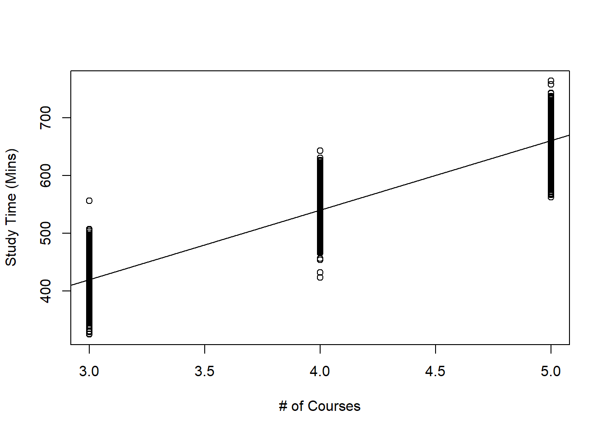
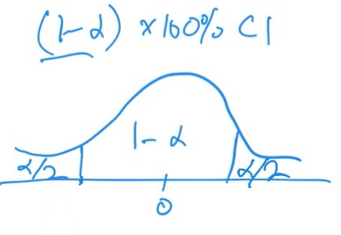
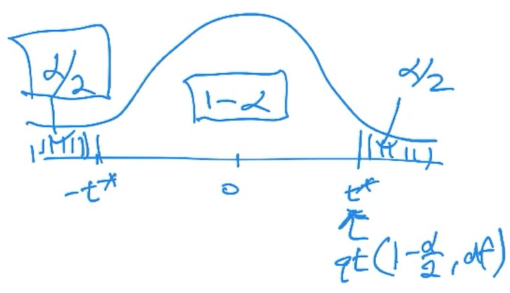

--- 
title: "Linear Methods for Data Science Notes"
author: "John Michael Epperson"
site: bookdown::bookdown_site
documentclass: book
classoption: openany
geometry: margin=3cm
bibliography:
- book.bib
- packages.bib
description: |
  This is a minimal example of using the bookdown package to write a book.
  set in the _output.yml file.
  The HTML output format for this example is bookdown::gitbook,
link-citations: true
---

# About {-}

These are my notes for the Fall 2024 session of STAT 6021: Linear Methods for Data Science at the School of Data Science at the University of Virginia.

The course is taught by Jeffrey Woo.

```{r include=FALSE}
# automatically create a bib database for R packages
knitr::write_bib(c(
  .packages(), 'bookdown', 'knitr', 'rmarkdown'
), 'packages.bib')
```

<!--chapter:end:index.Rmd-->

# Syllabus Week {-}

## Agenda

- Welcome
- Live Session
- Some logistical tips
- Meet group members
- Q&A on Protocol and Policies
- Q&A on Modules A & B (Review Material)


<!--chapter:end:00_mod0.Rmd-->

# Data Wrangling with R

## Cheat Sheet {-}

  * pipes "%>%" are interpreted as 'and then' in code
    * can be typed or accessed by Ctrl+Alt+M

```{r echo=FALSE,results='asis', eval=FALSE}
library(knitr)
mod1cheatsheet<-read.csv("tables/mod1cheatsheet.csv",header=TRUE)
mod1cheatsheet
kable(mod1cheatsheet,caption = "Data Wrangling Cheat Sheet")
```


## Data Wrangling Using Base R Functions
```{r}
Data<-read.csv("datasets/ClassDataPrevious.csv",header = TRUE)
dim(Data)
```

```{r}
colnames(Data)
```

```{r}
Data[1,2]
```

```{r}
Data[c(1,3,4),c(1,5,8)]
```
To view a column
```{r, eval=FALSE}
Data$Year
Data[,1]
Data[,-c(2:8)]
```

```{r}
which(Data$Sport=="Soccer")
SoccerPeeps<-Data[which(Data$Sport=="Soccer"),]
dim(SoccerPeeps)
```

```{r}
SoccerPeeps_2nd<-Data[which(Data$Sport=="Soccer" & Data$Year=="Second"),]
dim(SoccerPeeps_2nd)
```

```{r}
Sleepy<-Data[which(Data$Sleep>8),]
```

### Changing Column Names

```{r}
names(Data)[c(1,7)]<-c("Yr","Computer")
```

Find and remove missing data

```{r, eval=FALSE}
is.na(Data)
```

```{r}
Data[!complete.cases(Data),]
```
### **Summarizing Variables**

```{r}
apply(Data[,c(2,4,6,8)],2,mean)
```
To not include missing values, use arg na.rm

```{r}
apply(Data[,c(2,4,6,8)],2,mean,na.rm=T)
```
In apply(), the second argument specifies whether to summarize row (put 1) or column (put 2) values

Since some of the means are very high, we can use the median instead to be a little more informative.

```{r}
apply(Data[,c(2,4,6,8)],2,median,na.rm=T)
```
### **Summarizing variable by groups**
use tapply()

```{r}
tapply(Data$Sleep,Data$Yr,median,na.rm=T)
```

```{r}
Data$Yr<-factor(Data$Yr,levels=c("First","Second","Third","Fourth"))
levels(Data$Yr)
```

```{r}
tapply(Data$Sleep,Data$Yr,median,na.rm=T)
```

```{r}
tapply(Data$Sleep,list(Data$Yr,Data$Computer),median,na.rm=T)
```

### **Create a new variable based on existing variable**
```{r}
sleep_mins<-Data$Sleep*60
deprived<-ifelse(Data$Sleep<7,"yes","no")
```

Create catagorical variable based on numerical value

```{r}
CourseLoad<-cut(Data$Courses,breaks=c(-Inf,3,5,Inf),labels=c("light","regular","heavy"))
```

Collapse levels
into upperclassmen and lowerclassmen

```{r}
levels(Data$Yr)
new.levels<-c("und","und","up","up")
Year2<-factor(new.levels[Data$Yr])
levels(Year2)
```
### **Combine data frames**

```{r}
Data<-data.frame(Data,sleep_mins,deprived,CourseLoad,Year2)
head(Data)
```
Can use cbind() alternatively for same result

```{r}
Data2<-cbind(Data,sleep_mins,deprived,CourseLoad,Year2)
```

When combining data frames which have different observations but the same columns, we can merge them using rbind()

```{r}
dat1<-Data[1:3,1:3]
dat3<-Data[6:8,1:3]
res.dat2<-rbind(dat1,dat3)
head(res.dat2)
```
**Export data frame to csv
```{r}
write.csv(Data,file="exports/newdata.csv",row.names=FALSE)
```

### **Sort data frame by column values**
to sort in ascending order by age, then descending
```{r}
Data_by_age<-Data[order(Data$Age),]
Data_by_age_des<-Data[order(-Data$Age),]

```

To sort ascending by age then by sleep:
```{r}
Data_by_age_sleep<-Data[order(Data$Age, Data$Sleep),]
```

***

## Data Wrangling Using dplyr Functions

First we'll clear our environment using rm(list=ls()), then load tidyverse, which contains the dplyr functions:
```{r}
rm(list=ls())
library(tidyverse)
```

```{r}
Data<-read.csv("datasets/ClassDataPrevious.csv",header=TRUE)
```

### Select Specific Columns of a Data Fram

use select() function, two ways to do it

```{r include=FALSE}
select(Data,Year)
```

Or use **Pipes**
```{r include=FALSE}
Data %>% 
  select(Year)
```

Pipes can be typed using either %>% or Ctrl+Shift+M on keyboard. To thing of the operations above, we can read the code as:

1. Take the data frame called Data
2. and then select the column named Year

In this way, we can interpret a pipe as "and then". Commands after pipe should be placed on a new line. Pipes are especially useful for lots of sequential commands.

### Select observations by conditions

The **filter()** function allows us to subset our data based on some conditions, for example, to select students whose favorite sport is soccer:

```{r include=FALSE}
filter(Data,Sport=="Soccer")
```

or use a pipe to store results in a new variable "SoccerPeeps"

```{r}
SoccerPeeps<-Data %>% 
  filter(Sport=="Soccer")

SoccerPeeps_2nd<-Data %>% 
  filter(Sport=="Soccer" & Year=="Second")

Sleepy<-Data %>% 
  filter(Sleep>8)

Sleepy_or_Soccer<-Data %>% 
  filter(Sport=="Soccer"|Sleep>8)
```

### Change Column Name

Changing the names of columns is easy with dplyr, use rename() function

```{r}
Data<-Data %>% 
  rename(Yr=Year,Comp=Computer)
```

### Summarizing Variables

The summarize() function allows us to summarize a column. Suppose we want to find the mean value of the numeric columns: Sleep, Courses, Age, Lunch:

```{r}
Data %>% 
  summarize(mean(Sleep,na.rm=T),mean(Courses),mean(Age),mean(Lunch,na.rm=T))
```

This output is cumbersome, but we can give names to each summary:

```{r}
Data %>% 
  summarize(avgSleep=mean(Sleep,na.rm = T),avgCourse=mean(Courses,na.rm = T),avgAge=mean(Age,na.rm=T),avgLun=mean(Lunch,na.rm = T))
```

As previously seen, some of these variables are suspiciously high, we can use the median instead of mean to get more informative results:

```{r}
Data %>% 
  summarize(avgSleep=median(Sleep,na.rm = T),avgCourse=median(Courses,na.rm = T),avgAge=median(Age,na.rm=T),avgLun=median(Lunch,na.rm = T))
```

### Summarizing Variable by Groups

If we want to find the median amount of sleep for 1st, 2nd, 3rd, and 4th years, we can use the 'group_by()' function.

```{r}
Data %>% 
  group_by(Yr) %>% 
  summarize(medSleep=median(Sleep,na.rm=T))
```

The way we can read the code is:
  1. Get the data frame called Data,
  2. and then group the observations by Yr,
  3. and the find the median amount of sleep by each Yr and store the median in a vector called medSleep
  
The order of the factor levels is in alphabetical, which isn't very useful. We can use the 'mutate()' function whenever we want to transform or create a new variable. In this case, we are transforming the variable 'Yr' by reordering the factor levels with the 'fct_relevel()' function:

```{r}
Data<-Data %>% 
  mutate(Yr<-Yr %>% 
           fct_relevel(c("First","Second","Third","Fourth")))
```

which reads:
  1. Get data frame called 'Data',
  2. and then transform the variable called 'Yr',
  3. and then reorder the factor levels

then we use pipes, the 'group_by()', and 'summarize()' functions like before:

```{r}
Data %>% 
  group_by(Yr) %>% 
  summarize(medSleep=median(Sleep,na.rm=T))
```

This output makes a lot more sense for this context.

To summarize a variable on groups formed by more than one variable, we just add the other variables in the 'group_by()' function:

```{r}
Data %>% 
  group_by(Yr,Comp) %>% 
  summarize(medSleep=median(Sleep,na.rm=T))
```

### Create a New Variable Based on Existing Variable(s)

As mentioned previously, the 'mutate()' function is used to transform a variable or to create a new variable. There are a few variations on this task, based on the type of variable you want to create, and the type of variable it is based on.

**Create a numeric variable based on another numerica variable**

The variable 'Sleep' is in number of hours. Suppose we need to convert the values of 'Sleep' to number of minutes, we can simply perform the following mathematical operation:

```{r}
Data<-Data %>% 
  mutate(Sleep_mins=Sleep*60)
```

and store the transformed variable called 'Sleep_mins' and add 'Sleep_mins' to the data frame called 'Data'.

**Create a binary variable based on a numeric variable**

Create binary variable called 'deprived'. An observation will obtain a value of 'yes' if they sleep less than 7 hours a night, and 'no' otherwise. We will then add this variable to the data frame called 'Data':

```{r}
Data<-Data %>% 
  mutate(deprived=ifelse(Sleep<7,"yes","no"))
```


**Create a categorical variable based on a numeric variable**

Suppose we want to create a categorical variable based on the number of courses a student takes. We will call this new variable 'CourseLoad', which takes on the following variables
  
  * 'light' if 3 courses or less
  * 'regular' if 4 or 5 courses
  * 'heavy' if more than 5 courses
  
and then add 'CourseLoad to the data frame 'Data'. We can use the 'case_when()' function from the 'dplyr' package, instead of the 'cut()' function:

```{r}
Data<-Data %>% 
  mutate(CourseLoad=case_when(Courses<=3 ~ "light",
                              Courses>3 & Courses <=5 ~"regular",
                              Courses>5 ~ "heavy"))
```

Note how the category names are suppied after a specific condition is specified.

**Collapsing Levels**

Sometimes a categorical variable has more levels than needed, so we may want to collapse the levels, as such in this case: collapsing 'Year' into upperclassmen and lowerclassmen.

```{r}
Data<-Data %>% 
  mutate(UpUnder=fct_collapse(Yr,under=c("First","Second"),up=c("Third","Fourth")))
```

here we've created a new variable called 'UpUnder', which is done by collapsing 'First' and 'Second' into a new factor called 'under', and collapsing 'Third' and 'Fourth' into a new factor called 'up'. 'UpUnder' is also added to the dataframe 'Data'.

### Combine Data Frames

To combine data frames which have different observations but the same columns, we can combine them using 'bind_rows()':

```{r}
dat1<-Data[1:3,1:3]
dat3<-Data[6:8,1:3]
res.dat2<-bind_rows(dat1,dat3)
head(res.dat2)
```

'bind_rows()' works the same way as 'rbind()'. Likewise, we can use 'bind_cols()' instead of 'cbind()'.

### Sort data frame by column values

To sort your data frame in ascending order by 'Age':

```{r}
Data_by_age<-Data %>% 
  arrange(Age)
```

To sort in descending order by 'Age':

```{r}
Data_by_age_des<-Data %>% 
  arrange(desc(Age))
```

To sort in ascending order by 'Age' first, then 'Sleep':

```{r}
Data_by_age_sleep<-Data %>% 
  arrange(Age,Sleep)
```

### More About Combining Datasets

```{r}
rm(list = ls())
#################
##load packages##
#################

library(nycflights13)
library(tidyverse)

##see dataframes from packages
##View(flights)

##check documentation
##?flights

##View(airlines)
##?airlines

##merge data frames that share one column with the same name
flight_airlines<-flights%>%
  inner_join(airlines,by="carrier")

##merge data frames with multiple shared common columns
##View(weather)
flights_weather<-flights%>%
  inner_join(weather, by=c("year","month","day","hour","origin"))

##merge data frames when columns have different names but same content
##View(airports)
flights_airports<-flights%>%
  inner_join(airports,by=c("dest"="faa"))

##similar function in base R, merge()

flight_airlines2<-merge(flights,airlines, by="carrier")
##View(flight_airlines2)

flights_weather2<-merge(flights,weather, by=c("year","month","day","hour","origin"))
##View(flights_weather2)

##not sure if you notice, the merge() function takes longer to run. 
##use proc.time() to time how long your code takes to run

begin<-proc.time()
flight_airlines2<-merge(flights,airlines, by="carrier")
proc.time()-begin

begin<-proc.time()
flight_airlines<-flights%>%
  inner_join(airlines,by="carrier")
proc.time()-begin

```

Basically, use innerjoin rather than merge because it's an order of magnitude faster

### A Note About Missing Values

Let's go over some standard missing values that R recognizes and how to handle nonstandard ones that R will not recognize

```{r}
rm(list = ls())
library(tidyverse)
Data<-read.csv("datasets/missing.csv",header=TRUE)
Data
```

Some of these observations are missing values

We can apply is.na() to dataframe to see which entries are viewed as missing:

```{r}
is.na(Data)
```

As we can see, R only recognized entries with NA and NaN as missing. These are the standard values for missing entries. Any other way is not recognized.

**Note**:

  * NaN represents undefined number
  * NA represents missing value

We can convert the non standard missing values to \'standard missing values\' using the 'replace()' function within the 'mutate()' function:

```{r}
Data<-Data %>% 
  mutate(Weight = replace(Weight, Weight == "na", NA))%>%
  mutate(Weight = replace(Weight, Weight == "N/A", NA))%>%
  mutate(Weight = replace(Weight, Weight == "", NA))

is.na(Data)
```

And just like that, the rest of the missing values are recognized as missing as they should be.


<!--chapter:end:01-mod1.Rmd-->

# Data Visualization with R Using `ggplot2`

## Introduction

Data viz tools summarize data in ways that people unfamiliar with statistics can easily interpret and understand.

In this module, we will learn how to create common data visualizations. The choice of viz is usually determined by whether we're looking at a categorical or quantitative variable. Discrete variables may be viewed as either categorical or quantitative depending on the context.

We'll be using functions from `ggplot2` to create visualizations. `ggplot2` is included in the `tidyverse` package.

```{r include=FALSE}
library(tidyverse)
```

We'll use the dataset `ClassDataPrevious.csv` as an example.

```{r}
Data<-read.csv("datasets/ClassDataPrevious.csv")
```

## Visualizations with a Single Categorical Variable

### Frequency Tables

Frequency tables are a  common tool to summarize categorical variables, giving us the number of observations, or counts, that belong to a categorical variable. These tables are created through the `table()` function.

Number of students in each year in our data; factoring first:

```{r}
Data$Year<-factor(Data$Year, levels = c("First","Second","Third","Fourth"))
mytab<-table(Data$Year)
mytab
```

We can report these numbers using proportions instead of counts using `prop.table()`

```{r}
prop.table(mytab)
```

Or percentages by multiplying by 100, rounded to 2 decimal places:

```{r}
round(prop.table(mytab)*100,2)
```

### Bar Charts

Bar charts are a simple way to visualize data, and can be viewed as a visual representation of frequency tables. To create a bar chart for the years of a these students, we use:

```{r}
ggplot(Data,aes(x=Year))+
  geom_bar()
```

We can read the number of students who are first, second, third, and fourth years by reading off the corresponding value on the vertical axis.

From these two lines of code, we can see the basic structure of visualizations with the `ggplot()` function:

  1. Supply `ggplot()` function with dataframe, and the x- and y- vars via the `aes()` function. End line with `+` and go to next line
  2. Specify graph type we want to create (called `geoms`) for a bar chart, this is `geom_bar()`.

These two _layers_ of code must be supplied for all data visualizations with `ggplot()`.

Additional layers may be added. e.g. we can change the orientation of the bar chart:

```{r}
ggplot(Data,aes(x=Year))+
  geom_bar()+
  coord_flip()
```

It is recommended that each layer is typed on a new line. Like pipes, you need a `+` to add another layer below.

Change colors of bars:

```{r}
ggplot(Data,aes(x=Year))+
  geom_bar(fill="purple")
```

To change outline of bars:

```{r}
ggplot(Data,aes(x=Year))+
  geom_bar(fill="blue",color="orange")
```


#### Customize Title and Labels of Axes in Bar Charts

To change orientatino of labels on x axis we add extra layer called `theme`. This will be useful when we have many classes and/or labels with long names.

To rotate labels on x-axis 90 degrees

```{r}
ggplot(Data,aes(x=Year))+
  geom_bar()+
  theme(axis.text.x=element_text(angle=90))
```

As we create more visualizations, it is good practice to give good axis titles and chart titles. To do this we use `labs()`:

```{r}
ggplot(Data, aes(x=Year))+
  geom_bar()+
  theme(axis.text.x = element_text(angle = 90))+
  labs(x="Year", y="Number of Students", title="Dist of Years")
```

Adjust the position of the title, center justify via `theme

```{r}
ggplot(Data, aes(x=Year))+
  geom_bar()+
  theme(axis.text.x = element_text(angle = 90)
        ,plot.title = element_text(hjust=0.5))+
  labs(x="Year", y="Number of Students", title="Dist of Years")
```

#### Create a Bar Chart using Proportions

Some steps involved in creating a bar chart with proportions rather than counts. First, create new dataframe, where each row is a year, then add proportion of each year into new column

```{r}
newData<-Data %>% 
  group_by(Year) %>% 
  summarize(Counts=n()) %>% 
  mutate(Percent=Counts/nrow(Data))
```

Here's what the code is doing, line by line

  1. Create new data from called `newData` from `Data`,
  2. and then groups the observations by `Year`,
  3. and then counts the number of observations in each `Year` and stores these values in a vector called `Counts`,
  4. and then creates a new vector called `Percent` by using the mathematical operations as specified in `mutate()`. `Percent` is added to `newData`.
  
Let's take a look at `newData`:

```{r}
newData
```

Now we can create a bar chart using proportions:

```{r}
ggplot(newData,aes(x=Year,y=Percent))+
  geom_bar(stat = "identity")+
  theme(axis.text.x = element_text(angle=90),
        plot.title = element_text(hjust=0.5))+
  labs(x="Year",y="Percentage of Students",title = "Dist of Years")
```

Note the following:

  1. In first layer we use `newData` instead of the old data frame. In `aes()` we specified a y-var, which we want to be `Percent`.
  2. In second layer, we specified `stat="identity"` inside `geom_bar()`.
  
## Visualizations with  a Single Quantitative Variable

### 5 Number Summary

The `summary()` function, when applied to a quantitative variable, produces the **5 Number Summary**: the minimum, first quartile (25^th^ percentile), median (50^th^ percentile), the mean, the third quartile (75^th^ percentile), and the maximum. For example, to obtain the five number summary of the ages of these students:

```{r}
summary(Data$Age)
```

Average is 19.57 years old. Notice the first quartile and median are both 19 years old, which means at least a quarter of the observations are 19 years old. Also not the max of 51 years old, so we have a student who is quite a lot older than the rest.

### Boxplots

A boxplot is a graphical representation fo the 5 number summary. To create a generic boxplot, use `ggplot()` with a layer specifying `geom_boxplot()`:

```{r}
ggplot(Data,aes(y=Age))+
  geom_boxplot()
```

Note we are still using the same structure when creating data visualizations with `ggplot()`.
  
  1. supply `ggplot()` with dataframe, x- and or y-variables via `aes()` function. End line with `+`
  2. next line specify graph type, in this case `geom_boxplot()`.
  
Notice there are outliers (observations that are a lot older or younger) that are denoted by the dots. One is the 51 year old, and 22 year olds are deemed to be outliers. The rule being used is the $1.5\times IQR$ rule.

Similar to bar charts, we can change the orientation of boxplots by adding an additional layer as before, can also change colors:

```{r}
ggplot(Data,aes(y=Age))+
  geom_boxplot(color="blue",fill="blue",outlier.color="brown")+
  coord_flip()
```

### Histograms

Histogram displays number of observations within each bin on the x-axis.

```{r}
ggplot(Data,aes(x=Age))+
  geom_histogram()
```

Note warning displayed when creating basic histogram, use `binwidth` arg within `geom_histogram()`. Try `binwidth=1` for now, which gives us a width of 1 unit for each bin.

```{r}
ggplot(Data,aes(x=Age))+
  geom_histogram(binwidth = 1)
```

The ages of the students are mostly young, with 19 and 20 year olds being the most commonly occuring.

A well-known drawback of histograms is that the width of the bins can drastically affect the visual. Change `binwidth` to 2 to see:

```{r}
ggplot(Data,aes(x=Age))+
  geom_histogram(binwidth = 2)
```

Each bar contains two ages now: the first contains 18 and 19 year olds. Notice how the shape has been changed? No good...

### Density Plots

Density plots are similar to histograms where the plot attempts to use a smooth mathematical function to approximate the shape of the histogram, is unaffected by binwidth:

```{r}
ggplot(Data,aes(x=Age))+
  geom_density(color="red")
```

Here it is easyt o see that 19 and 20 year olds are the most common ages in this data. Be careful interpreting values on the vertical axis: **these do not represent proportions**. A characteristic of density plots is that the area under the plot is always one.

## Bivariate Visualizations

Bivariate visualizations help show the relationship between **two variables**.

We will be using a new dataset as an example, so we'll clear the environment.

```{r}
rm(list=ls())
```

Use dataset `gapminder` from `gapminder` package.

```{r}
library(tidyverse)
library(gapminder)
```

Take a look at `gapminder` dataset:

```{r}
head(gapminder)
```

Variables are:
  1. `country`
  2. `continent`
  3. `year` from 1952 to 2007 in increments of 5 years
  4. `lifeExp` life expectancy at birth in years
  5. `pop` as in population of country
  6. `gdpPercap` GDP per capita in US dollars, adjusted for inflation

Note that the data here are collected from each contry across many different years: 1952 to 2007 in increments of 5 years. We will mainly focus on data from the most recent year, 2007.

```{r}
Data<-gapminder %>% 
  filter(year==2007)
```

The specific visuals to use will again depend on the type of variables we are using, whether they are categorical or quantitative.

### Compare Quantitative Variable Across Categories

#### Side-by-Side Boxplots

These are useful to compare a quantitative variable across different classes of a categorical variable. e.g. we want to compare life expectancy across different continents in year 2007

```{r}
ggplot(Data,aes(x=continent,y=lifeExp))+
  geom_boxplot(fill="red")+
  labs(x="Continent",y="Life Exp.",title = "Dist. of Life Expectancies by Continent")
```

As we can see, countries in Oceania region have long life expectancies with little variation. Comparing the Americas to Asia, the median life expectancies are similar, but the spread is larger in Asia.

#### Violin Plots

Violin plots are alternative to boxplots. Here's how it's done:

```{r}
ggplot(Data,aes(x=continent,y=lifeExp))+
  geom_violin(fill="purple")+
  labs(x="Continent",y="Life Exp.",title = "Dist. of Life Expectancies by Continent")
```

The width of the violin informs us which values are more commonly occurring. For example, look at Europe: violin is wider at high life expectancies, so longer life expectancies are more common in European countries.

### Summarizing Two Categorical Variables

create new binary variable called `expectancy`, which will be denoted as `low` if the life expectancy is less than 70 years, `high` otherwise:

```{r}
Data<-Data %>% 
  mutate(expectancy=ifelse(lifeExp<70,"Low","High"))
```

#### Two-Way Tables

See how expectancy varies across the continents. **Two-way table** can be created to produce counts when **two categorical variables** are involved.

```{r}
Data<-Data %>% 
  mutate(expectancy=expectancy %>% 
           fct_relevel(c("Low","High")))
mytab2<-table(Data$continent,Data$expectancy)
mytab2
```

First variable in `table()` will be placed in the rows, second will be columns.

From this table, we can see that 22 countries in the Americas have high life expectancies, and only 3 with low life expectancies.

If interested in proportions, rather than counts, convert using `prop.table()`:

```{r}
round(prop.table(mytab2,1)*100,2)
```

Here, the second argument to `prop.table()` indicates that the **rows** should add up to 1, if instead we want the **columns** to add to 1, we should set the second argument to 2.

#### Stacked Bar Charts

A stacked bar chart can be used to display relationship between binary variable `expectancy` across continents.

```{r}
ggplot(Data,aes(x=continent,fill=expectancy))+
  geom_bar(position = "stack")+
  labs(x="Continent", y="Count", title="Life Expectancies by Continent")
```

Shows how many countries exist in each continent and how many of these have high or low life expectancies. About 25 countries in the Americas, where the majority have high life expectancies.

Can change the way the bar chart is displayed by changing `position` in `geom_bar()` to `position = dodge` or `position = fill`, the latter being more useful for proportions instead of counts:

```{r}
ggplot(Data, aes(x=continent, fill=expectancy))+
  geom_bar(position = "dodge") 
```

```{r}
ggplot(Data, aes(x=continent, fill=expectancy))+
  geom_bar(position = "fill")+
  labs(x="Continent", y="Proportion", 
       title="Proportion of Life Expectancies by Continent")
```

### Summarizing Two Quantitative Variables

#### Scatterplots

Scatterplots are pretty standard for two quantitative variables

Let's see life expectancy vs GDP per capita

```{r}
ggplot(Data,aes(x=gdpPercap,y=lifeExp))+
  geom_point(color="blue")
```

A curved relationship between lifeExp and GDP per cap is clearly visible here. Countries with higher GDP tend to have longer life expectancy.

Since some observations may overlap, we may want to add a transparency scale called `alpha=0.2` inside `geom_point()`:

```{r}
ggplot(Data, aes(x=gdpPercap,y=lifeExp))+
  geom_point(alpha=0.5)+
  labs(x="GDP", y="Life Exp", 
       title="Scatterplot of Life Exp against GDP")
```

Default value for `alpha` is 1, which means the points are not at all transparent. Closer to 0 means more transparent. Darker points indicate more observations with those values on both variables. Can see hot spots easily.

## Multivariate Visualizations

Multivariate Visualizations explore the relationship between **multiple** (more than two) variables.

### Bar Charts

Let's do a multivariate bar chart; suppose we want to compare life expectancy between continents, throughout the years.

```{r}
Data.all<-gapminder %>% 
  mutate(expectancy=ifelse(lifeExp<70,"Low","High"))

ggplot(Data.all,aes(x=continent,fill=expectancy))+
  geom_bar(position="fill")+
  facet_wrap(~year)
```

Note that three categorical values are summarized in this bar chart. How should we improve this bar chart?

  * We could rotate the labels on the x-axis:
  
```{r}
Data.all<-gapminder %>% 
  mutate(expectancy=ifelse(lifeExp<70,"Low","High"))

ggplot(Data.all,aes(x=continent,fill=expectancy))+
  geom_bar(position="fill")+
  facet_wrap(~year)+
  theme(axis.text.x = element_text(angle=90))
```


### Scatterplots

Let's do a multivariate scatterplot, like the one earlier - life expectancy vs GDP per capita - but make the size of the plots denote the population of the countries. This is supplied via `size` in `aes()`:

```{r}
ggplot(Data,aes(x=gdpPercap,y=lifeExp,size=pop))+
  geom_point()
```

We can adjust the size of the plots by adding a layer `scale_size()`:

```{r}
ggplot(Data, aes(x=gdpPercap,y=lifeExp,size=pop))+
  geom_point()+
  scale_size(range=c(0.1,12))
```

We can use different-colored plots to denote which continent each point belongs to:

```{r}
ggplot(Data,aes(x=gdpPercap,y=lifeExp,size=pop,color=continent))+
  geom_point()+
  scale_size(range=c(0.1,12))
```

This summarizes three quantitative variables and one categorical variables.

Finally, we can adjust the plots by changing its shape and making it more translucent via `shape` and `alpha` in `aes()`:

```{r}
ggplot(Data,aes(x=gdpPercap,y=lifeExp,size = pop,fill = continent))+
  geom_point(shape=21,alpha=0.5)+
  scale_size(range=c(0.1,12))+
  labs(x="GDP", y="Life Exp", title="Scatterplot of Life Exp against GDP")
```


<!--chapter:end:02-mod2.Rmd-->

# Introduction to Simple Linear Regression


## Introduction

**Simple** linear regression is called simple because it concerns the study of only one predictor variable with one quantitative response variable. **Multiple** linear regression, which will be covered later, concerns the study of two or more predictor variables with one quantitative response variable.

For now, we'll only look at quantitative predictor variables.

Scatter plots are the most common way of visualizing the relationship between one quantitative predictor variable and one quantitative response variable. In example below, we have data from 6000 UVA Undergrad students on amount of time studying per week and number of courses taken in semester.

```{r eval=FALSE}
##create dataframe
df<-data.frame(study,courses)

##fit regression
result<-lm(study~courses, data=df)
```
```{r eval=FALSE}
##create scatterplot with regression line overlaid
plot(df$courses, df$study, xlab="# of Courses", ylab="Study Time (Mins)")
abline(result)
```

```{r scattercourses, echo=FALSE, fig.align='center',fig.cap="Scatterplot of Study Time vs. Number of Courses Taken"}

```


Questions may include:

* Are study time and number of courses taken related to one another?

* How strong is this relationship?

* Could we use the data to make a prediction for the study time of a student who is not in this scatterplot?

* How confident are we of the prediction?

Simple linear regression can help answer these questions.

**A Note**: _multiple_ linear regression refers to regressions of multiple predictor variables and _only one_ response variable. Whereas _multivariate_ regression also refers to multiple predictor variables and _multiple_ response variables.

So in review:

* multiple linear regression: >2 predictors, 1 response vars

* multivariate regression: >2 predictors, >2 response vars

### Basic Ideas with Statistics

#### Population vs. Sample

Statistical methods are usually used to make inferences about the **population** based on information from a **sample**.

* A sample is the collection of units that is actually measured or surveyed in a study.
* The population includes all units of interest.

In the study time example above, the population is all UVA Undergrads, while sample is the 6000 students that we have data on and are displayed on the scatter-plot.

#### Parameter vs. Statistic

* **Parameters** are numerical quantities that describe a population
* **Statistics** are numerical quantities that describe a sample

In the above example, a paramter would be the average study time among all undergrad students (called population mean), and example of statistic could be the average study time of the 6000 UVA students we have data on (called sample mean).

We rarely know the actual numerical value of a paramter, so we use the numerical value of the statistic to estimate the unknown numerical value corresponding to the parameter.

We also have different notation for parameters and statistics:

* population mean: $\mu$
* sample mean: $\bar{x}$

We say that $\bar{x}$ is an **estimator** of $\mu$.

Pay attention to whether a statistic (known variable) or parameter (unknown variable) is being described.

### Motivation

Linear regression models generally have two primary uses:

1. **Prediction**: Predict a future value of a response variable, using information from predictor variables.

2. **Association**: Quantify the relationship between variables. How does a change in the predictor variable change the value of the response variable?

We always distinguish between **response variable, denoted by _y_**, and a **predictor variable, denoted by _x_**. And that the response variable may be approximated by some mathematical function, denoted by _f_, of the predictor variable, i.e.

\begin{equation}
y\approx f(x)
\end{equation}

Often this is written as:

\begin{equation}
y = f(x) + \epsilon
\end{equation}

where $\epsilon$ **denotes a random error term**, with mean 0. The error term cannot be predicted based on the data we have.

There are various statistical methods to estimate _f_. Once we estimate _f_, we can use our method for prediction and or association.

Using the study time example:

* a prediction example: a student intends to take four courses this semester. What is this students predicted study time, on average?

* an association example: we want to see how taking more courses increases study time.

#### Practice Questions

Are we using a regression model for prediction or association?

1. It is early in the morning and I am heading out for the rest of the day. I want to know the weather forecast for the rest of the day so I know what to wear.

* Prediction

2. An exec for a sports league wants to assess how increasing the length of commercial breaks may impact enjoyment of sports fans who watch games on TV.

* Association

3. The Education Secretary would like to evaluate how certain factors such as use of technology in classrooms and investment in teacher training and teacher pay are associated with reading skills of students.

* Association

4. When buying a home, the prospective buyer would like to know if the home is under- or over- priced, given its characteristics.

* Prediction

## Simple Linear Regression (SLR)

In simple linear regression, the function _f_ that relates the predictor variable with the response variable is typically $\beta_0 + \beta_1 x$. Mathematically, we express this as:

\begin{equation}
y\approx \beta_0 + \beta_1 x
\end{equation}

or in other words, the response variable has an approximately linear relationship with the predictor variable.

In SLR, this relationship is more explicitly formulated as the **simple linear regression equation**:

\begin{equation}
E(y|x) = \beta_0 + \beta_1 x
(\#eq:slreq)
\end{equation}

* $\beta_0$ and $\beta_1$ are parameters of the SLR equation, and we want to estimate them.

* These parameters are called **regression coefficients**

* $\beta_1$ is called the slope, which denotes the change in _y_, on average, when _x_ increases by one unit.

* $\beta_0$ is called the intercept, denotes the average of _y_ when $x=0$.

* notation on left denotes the **expected** value of response variable, for a fixed value of the predictor variable. Equation \@ref(eq:slreq) implies that for each value of the predictor variable _x_, the expected value of the response variable _y_ is $\beta_0+\beta_1 x$. The expected value is also the population mean. Applying \@ref(eq:slreq) to our study time example, it implies that:

  * for students who take 3 courses, their expected study time is $\beta_0+3\beta_1 x$
  * 4 courses $\beta_0+4\beta_1 x$
  * 5 courses $\beta_0+5\beta_1 x$
  
So $f(x)=\beta_0+\beta_1 x$ gives us the value of the response variable for a specific value of the predictor variable. But for each predictor value, the value of the response is not constant. We say that for each value of _x_, the response variable _y_ has some variance. The variance of the response for each value of _x_ is the same as the variance of the error term, $\epsilon$. Thus we have the **simple linear regression model**:

\begin{equation}
=\beta_0+\beta_1 x + \epsilon
(\#eq:slrmodel)
\end{equation}

Need to make some assumptions for error term $\epsilon$. Generally, the assumptions are:

1. errors have a mean of 0

2. errors have variance denoted by $\sigma^2$, this variance is constant

3. Errors are independent

4. Errors are normally distributed

From \@ref(eq:slrmodel) notice we have another parameter, $\sigma^2$.

In module 5 we'll cover how to determine if these assumptions are met.

These assumptions mean that for each value of predictor variable _x_, response variable:

1. follows normal distribution

2. has mean equal to $\beta_0+\beta_1 x$,

3. has variance equal to $\sigma^2$.

Using our study time example, it means that:

* student takes 3 courses, dist. of their study times is $N(\beta_0+3\beta_1,\sigma^2)$
* 4 courses: $N(\beta_0+4\beta_1,\sigma^2)$
* 5 courses: $N(\beta_0+5\beta_1,\sigma^2)$

Can create subsets of students who take 3, 4, and 5 courses and create density plot of study times for each subset. These plots should follow a normal distribution, with different means, but same spread.

look at density plots next:

Okay so I don't have the data at my disposal so just take my word for.... the plots are all normal, with different means (centers) and similar spreads. Here's one:

```{r 3coursestudy, echo=FALSE, fig.align='center',fig.cap="Distribution of Study Time For 3 Courses"}
knitr::include_graphics("images/3coursestudy.png")
```

## Estimating Regression Coefficients in SLR

The sample versions of Equations \@ref(eq:slreq) and \@ref(eq:slrmodel) are given by:

\begin{equation}
\hat{y}=\hat{\beta_0}+\hat{\beta_1}x
(\#eq:est-slr)
\end{equation}

and

\begin{equation}
y=\hat{\beta_0}+\hat{\beta_1}x+e
(\#eq:est-slrmod)
\end{equation}

respectively. Equation \@ref(eq:est-slr) is called the **Estimated SLR Equation**, or the Fitted SLR Equation and Equation \@ref(eq:est-slrmod) is called the **Estimated SLR Model**.


$\hat{\beta_0}$, $\hat{\beta_1}$ are the **estimators** of $\beta_0$,$\beta_1$ respectively. They may be interpreted in the following manner:

* $\hat{\beta_1}$ denotes the change in the predicted _y_ when _x_ increases by 1 unit. Alternatively it denotes the change in _y_, on average, when _x_ increases by 1 unit.

* $\hat{\beta_0}$ denotes the predicted _y_ when $x=0$. Alternatively, it denotes the average of _y_ when $x=0$.

From Equation \@ref(eq:est-slrmod), note we use $e$ to denote the residual, or "error" in the sample.

From Equations \@ref(eq:est-slr) and \@ref(eq:est-slrmod), we have the following quantities we can compute:

The predicted/fitted values given by:

\begin{equation}
\hat{y}=\hat{\beta_0}+\hat{\beta_1}x
\end{equation}

Residuals, or error, given by the difference between the true mean, $y_i$ and sample mean, $\hat{y_i}$:

\begin{equation}
e_i = y_i - \hat{y_i}
\end{equation}

Finally, the **Sum of Squared Residuals** from the previous equation:

\begin{equation}
SS_{res}=\displaystyle\sum_{n}^{i=1}(y_i-\hat{y_i})^2
(\#eq:ssres)
\end{equation}

We compute the estimated coefficients $\hat{\beta_1}$, $\hat{\beta_0}$ using the **method of least squares**; i.e. find values of $\hat{\beta_1}$, $\hat{\beta_0}$ which minimize $SS_{res}$ as given in Equation \@ref(eq:ssres).

By minimizing $SS_{res}$ with respect to $\hat{\beta_1}$ and $\hat{\beta_0}$, the estimated coefficients in the simple linear regression equation are:

\begin{equation}
\hat{\beta_1}=\frac{\displaystyle\sum_{i=1}^{n}(x_i-\bar{x})(y_i-\bar{y})}{\displaystyle\sum_{i=1}^{n}(x_i-\bar{x})^2}
(\#eq:beta1)
\end{equation}

and

\begin{equation}
\hat{\beta_0}=\bar{y}-\hat{\beta_1}\bar{x}
(\#eq:beta0)
\end{equation}

$\hat{\beta_1}$, $\hat{\beta_0}$ are called **least squares estimators**.

Minimization of $SS_{res}$ is done by taking partial derivatives WRT $\hat{\beta_1}$ and $\hat{\beta_0}$ setting these two partial derivatives equal to 0, and solving these two equations for $\hat{\beta_1}$ and $\hat{\beta_0}$.

Using our study time example:

```{r eval=FALSE}
##fit regression
result<-lm(study~courses, data=df)
##print out the estimated coefficients
result
```

```{r eval=FALSE}
## 
## Call:
## lm(formula = study ~ courses, data = df)
## 
## Coefficients:
## (Intercept)      courses  
##       58.45       120.39
```


From this we can see that for our sample of 6000 students:

* $\hat{\beta_1}=120.39$, so study time increases 120.39 minutes for each additional course taken.

* $\hat{\beta_0}=58.45$, so predicted study time is 58.45 minutes when no courses are taken... which doesn't make sense. This is an example of **extrapolation**, which you _should never do_. We can only make predictions of the response variable inside the range of the data, i.e. $3 \leq x \leq 5$ hours.

## Estimating Variance of Errors in SLR

The estimator of $\sigma^2$, the variance of the error terms (also the variance of the probability distribution of _y_ given _x_) is

\begin{equation}
s^2=MS_{res}=\frac{SS_{res}}{n-2}=\frac{\displaystyle \sum_{i=1}^{n}e_i^2}{n-2}
(\#eq:msres)
\end{equation}

Where $MS_{res}$ is called the **mean squared residuals**.

$\sigma^2$, the variance of the error terms, measures spread of the response variable, for each value of _x_. The smaller this is, the closer the data points are to the regression equation.

### Practice Questions

On plot from above figure, label the following:

  1. estimated SLR Equation
  2. fitted value when $x=3,x=4,x=5$
  3. residual for any data point on the plot of your choosing
  
```{r prac1, echo=FALSE, fig.align='center',fig.cap="Answers"}
knitr::include_graphics("images/prac1.png")
```

## Assessing Linear Association

Variance of error terms tells us how close data points are to the estimated SLR equation. Smaller variance of error terms means closer data points are to estimated SLR equation. This would imply the linear relationship between variables is stronger.

Will learn how to quantify that strength later, but now need more terms.

### Sum of Squares

Total sum of squares is defined as the **total variance in the response variable**. The larger this value is, the larger the spread is of the response variable.

Regression sum of squares is defined as the **variance in the response variable that can be explained by our regression**

Then we have the residual sum of squares, $SS_{res}$. It's defined as the **variance in the response variable that cannot be explained by our regression**.

It can be shown that:

\begin{equation}
SS_T=SS_R+SS_{res}
\end{equation}

Each of the sums of squares has its associated **degrees of freedom (df)**:

* $SS_R: df_R=1$
* $SS_{res}: df_{res}=n-2$
* $SS_T: df_T=n-1$


### ANOVA Table

Info regarding sum of squares is usually given in form of **ANOVA (analysis of variance) table**: 

Note:

* dividing each sum of squares by its degrees of freedom gives the corresponding mean square

* the $F$ statistic is associated with an **ANOVA F Test** which we will look at in more detail in the next subsection.

To obtain the ANOVA table for our study time example:

```{r eval=FALSE}
anova(result)

## Analysis of Variance Table
## 
## Response: study
##             Df   Sum Sq  Mean Sq F value    Pr(>F)    
## courses      1 57977993 57977993   65404 < 2.2e-16 ***
## Residuals 5998  5317017      886                      
## ---
## Signif. codes:  0 '***' 0.001 '**' 0.01 '*' 0.05 '.' 0.1 ' ' 1
```

Note that R does not print out the info for line regarding $SS_T$.

### ANOVA F Test

In SLR, the ANOVA $F$ statistic from the ANOVA table can be used to test if the slope of the SLR equation is 0 or not. In short, this tells us whether or not the variables are linearly associated.

The null and alternative hypotheses are:

$H_0: \beta_1=0, H_a: \beta_1 \ne 0$

The test statistic is

\begin{equation}
F=\frac{MS_R}{MS_{res}}
(\#eq:fstat)
\end{equation}

and is compared with an $F_{1,n-2}$ distribution. Note that $F_{1,n-2}$ is read as an **F distribution with 1 and $n-2$ degrees of freedom**.

Going back to study time example, $F$ statistic is 6.5404^{4}. Criitical value can be found using:


```{r}
qf(1-0.05,1,6000-2)
```

Since our test statistic is larger than the critical value, we reject the null hypothesis. Our data support the claim that the slope is different from 0, in other words, there is a linear association between study time and number of courses taken.

### Coefficient of Determination

The **coefficient of determination**, $R^2$, is

\begin{equation}
R^2=\frac{SS_R}{SS_T} = 1-\frac{SS_{res}}{SS_T}
\end{equation}

$R^2$ is an indication of how well the data fits our model. It denotes **the proportion of variance in the response variable that is explained by the predictor**.

A few notes about $R^2$:

* $0\le R^2\le1$
* Values closer to 1 indicate a better fit; closer to 0 indicates a poorer fit
* Sometimes it is reported as a percentage

To obtain $R^2$ for our study time example:

```{r eval=FALSE}
anova.tab<-anova(result)
##SST not provided, so we add up SSR and SSres
SST<-sum(anova.tab$"Sum Sq")
##R2
anova.tab$"Sum Sq"[1]/SST
```

```{r eval=FALSE}
## [1] 0.9159963
```

This implies that the proportion of variance in study time that can be explained by the number of courses taken is ~ 0.916.

### Correlation

A measure used to quantify the strength of the linear association between two quantitative variables is the **sample correlation**. The sample correlation `corr(x,y)` or _r_ is given by:

an equation that would take too much typing than is worth it, go look [at (3.16) in Professor Woo's Notes](https://jwoosds.github.io/linear_models/slr.html#correlation) if you need it

A few notes about _r_:

* _r_ is always between -1 and 1
* Sign of correlation indicates direction of association. i.e. positive val indicates positive linear association, if predictor val increases, so does response; for a negative correlation means that if predictor increases, response decreases, on average
* values closer to 1 or -1 indicate stronger linear association, closer to 0 indicates weak linear association
* In SLR it turns out that $r^2=R^2$

Using study time example, correlation between study time and \# of courses taken is:

```{r eval=FALSE}
cor(df$study,df$courses)
```

```{r eval=FALSE}
## [1] 0.9570769
```

This indicates a very strong positive linear relationship between study time and number of courses taken

#### How strong is strong?

**Strong enough** depends on the context. value of correlation should be compared with correlations from similar studies in that domain to determine if it is strong or not.

## Word of Caution

Always look at the scatterplot first to verify that the association between variables is approximately linear **before** using the measures we have learned (correlation, $R^2$). If you see non-linear pattern, don't use these measures. We'll see how to remedy a non-linear pattern in scatterplot in module 5.

## R Tutorial

```{r results='hide'}
library(tidyverse)
library(openintro)
Data<-openintro::elmhurst
```

### Visualization

```{r}
##scatterplot of gift aid against family income
ggplot2::ggplot(Data, aes(x=family_income,y=gift_aid))+
  geom_point()+
  geom_smooth(method = "lm")+
  labs(x="Family Income", y="Gift Aid", title="Scatterplot of Gift Aid against Family")
```

Since we see the observations are fairly evenly scattered on both sides of the regression line, a linear association exists. What we see is a negative linear association. As family income increases, the gift aid, on average decreases.

We also do not see any observation with weird values that may warrant further investigation.

### Regression

Use `lm()` function to fit a regression model

```{r}
##regress gift aid against family income
result<-lm(gift_aid~family_income, data=Data)
```

Then use `summary()` function to display relevant information from this regression:

```{r}
summary(result)
```

We see the following values:

* $\hat{\beta_1} = -0.04307$, the estimated slope, which informs us that the predicted gift aid decreases by 0.04307 thousands of dollars (\$43.07) per unit increase in family income.

* $\hat{\beta_0}=24.31933$ which means that for students with no family income, the predicted aid is \$24,319.33. Note: from scatterplot, we have an observation with 0 family income. Must be careful to not extrapolate when making predictions with our regression. Only make predictions for family incomes between minimum and maximum family incomes in our data.

* $s=4.7825$, the estimate of the standard deviation of the error terms. This is reported as residual standard error in R. Squaring this gives the estimated variance.

* $F=15.877$, this is the value of the ANOVA $F$ statistic. The corresponding p-value is reported. Since this p-value is very small, so we reject the null hypothesis. The data support the claim that there is a linear association between gift aid and family income.

* $R^2 = 0.2486$, the coefficient of determination informs us that about 24.86% of the variation in gift aid can be explained by family income.

### Extract Values from R Objects

We can extract these values that are being reported from `summary(result)`. To see what can be extracted from an R object, use the `names()` function.

```{r}
names(summary(result))
```

Now to get the coefficients:

```{r}
summary(result)$coefficients
```

Since this info is presented in a table, we can extract specific values by specifying the row and volumn indices:

```{r}
##extracting slope
summary(result)$coefficients[2,1]
```

```{r}
##extracting intercept
summary(result)$coefficients[1,1]
```

```{r}
##residual standard error
sd(summary(result)$residuals)
```

```{r}
##ANOVA F-statistic
summary(result)$fstatistic[1]
```

```{r}
##r squared
summary(result)$r.squared
```

### Prediction

One use of regression models is prediction. Suppose I want to predict the gift aid of a student with family income of \$50,000, use the `predict()` function to accomplish this.

```{r}
##create new data point for prediction
newdata<-data.frame(family_income=50)
##predicted gift aid when x=50
predict(result,newdata)
```


The students predicted gift aid is \$22,165.75. Alternatively, you could plug $x=50$ into the estimated SLR equation, Equation \@ref(eq:est-slr).

```{r}
summary(result)$coefficients[1,1] + summary(result)$coefficients[2,1]*50
```

### ANOVA Table

We use the `anova()` function to display ANOVA table

```{r}
anova.tab<-anova(result)
anova.tab
```

The reported $F$ statistic is the same as the value reported earlier from `summary(result)`.

First line of output gives $SS_R$, second line gives $SS_{res}$. Function doesn't provide $SS_T$, but we know that $SS_T=SS_R+SS_{res}$.

To see extractable values from `anova.tab`

```{r}
names(anova.tab)
```

To calculate $SS_T$

```{r}
SST<-sum(anova.tab$"Sum Sq")
SST
```

$R^2$ was reported to be 0.24855. Verify using ANOVA table:

```{r}
anova.tab$"Sum Sq"[1]/SST
```

### Correlation

Can use `cor()` function to find correlation between two quantitative variables:

```{r}
##correlation
cor(Data$family_income,Data$gift_aid)
```

The correlation is -0.4985, meaning we have a moderate negative linear association between family income and gift aid.


<!--chapter:end:03-simple_linear_regression.Rmd-->

# Inference with Simple Linear Regression (SLR)

## Introduction

Estimated slope and intercept will vary from sample to sample. In inferential statistics, we use hypothesis tests and confidence intervals to help quantify this variation. In this module, we learn how to account for and quantify random variation of estimated regression model, and how to interpret the model while accounting for random variation.

## Hypothesis Testing in SLR

### Distribution of Least Squares Estimators

**Gauss Markov Theorem**: Under assumptions for a regression model, the least squares estimators $\hat{\beta_1}$ and $\hat{\beta_0}$ are unbiased and have minimum variance among all unbiased linear estimators.

Thus the least squares estimators have the following properties:

1. $E(\hat{\beta_1})=\hat{\beta_1},E(\hat{\beta_0})=\hat{\beta_1}$

  Note: An estimator is unbiased if its expected value is exactly equal to the parameter it is estimating.
  
2. The variance of $\hat{\beta_1}$ is

\begin{equation}
\text{Var}(\hat{\beta_1})=\frac{\sigma^2}{\sum{(x_i-\bar{x})^2}}
\end{equation}

3. The variance of $\hat{\beta_0}$ is:

\begin{equation}
\text{Var}(\hat{\beta_0})=\bar{x^2}\left[\frac{\sigma^2}{\sum{(x_i-\bar{x})^2}}\right]
\end{equation}

4. Both $\hat{\beta_1}$ and $\hat{\beta_1}$ follow a normal distribution.

Note that in the above equations, we use $s^2=MS_{res}$ to estimate $\sigma^2$ since it is an unknown value.

What these imply is that if we standardize $\hat{\beta_1}$ and $\hat{\beta_0}$, these standardized quantities will follow a $t_{n-2}$ distribution, i.e.

\begin{equation}
\frac{\hat{\beta_1-\beta_0}}{se(\hat{\beta_1)} ~ t_{n-2}}\text{      and       }   \frac{\hat{\beta_0-\beta_1}}{se(\hat{\beta_0)}} ~ t_{n-2}
(\#tn2)
\end{equation}

Note:

* $se(\hat{\beta_1}$ is read as the **standard error of $\hat{\beta_1}$. The standard error of any estimator is essentially the sample standard deviation of that estimator, and measures the spread of that estimator.

* A $t_{n-2}$ distribution is read as a _t_ distribution with $n-2$ degrees of freedom.

### Testing Regression Coefficients

Hypothesis testing is used to investigate if a population parameter is **different from a specific value.** 

The general steps for hypothesis testing are:

1. State the null and alternative hypotheses.

2. A test statistic is calculated using the sample, assuming the null is true. The value of the test statistic measures how the sample **deviates from the null**

3. Make conclusion, using either critical values or p-values.

In the previous module, we introduced the ANOVA _F_ test. In SLR, this tests if the slope of the SLR equation is 0 or not. It turns out that we can also perform a _t_ test for the slope. In the _t_ test for the slope, the null and alternative hypotheses are:

\begin{equation}
H_0: \beta_1=0, H_a: \beta_1 \ne 0 \notag
\end{equation}

The test statistic is:

\begin{equation}
t=\frac{\hat{\beta_1}-\text{value in null}}{se(\hat{\beta_1})}
(\#eq:tstat)
\end{equation}

which is compared with a $t_{n-2}$ distribution.

Let's look at our simulated example that we saw in the last module. We have data from 6000 UVA undergrads on the amount of time they spend studying in a week (in minutes), and how many courses they are taking.

```{r eval=FALSE}
##create dataframe
df<-data.frame(study,courses)

##fit regression
result<-lm(study~courses, data=df)
##look at regression coefficients
summary(result)$coefficients
```


```{r eval=FALSE}
##              Estimate Std. Error   t value      Pr(>|t|)
## (Intercept)  58.44829  1.9218752  30.41211 4.652442e-189
## courses     120.39310  0.4707614 255.74125  0.000000e+00
```


The _t_ statistic for testing the null and alt. hypotheses is reported to be ~255.74, which can be calculated using Equation \@ref(eq:tstat): $t=\frac{120.39-0}{0.4707}$. The reported p-value is virtually zero, so we reject the null hypothesis. The data support the claim there is a linear association between study time and the number of courses taken.

## Confidence Intervals for Regression Coefficients

Confidence intervals are similar to hypothesis testing in the sense that they are also based on the distributional properties of an estimator. CIs may differ in their use in the following ways:

1. We are not assessing if the parameter is different from a specific value.

2. We are more interested in exploring a plausible **range of values for an unknown parameter**.

Because CIs and hypothesis are based on the distributional properties of an estimator, their conclusions will be consistent (as long as the significance level is the same).

Recall the general form for CIs:

\begin{equation}
\text{estimator}\pm(\text{multiplier}\times\text{s.e. of estimator})
(\#eq:cigeneral)
\end{equation}

Components of a CI

  * **estimator (or statistic)**: numerical quantity that describes a sample
  
  * **multiplier**: determined by confidence level and relevant probability distribution
  
  * **standard error estimator**: measure of variance of estimator (basically the square root of the variance of estimator)
  
Following Equations \@ref(eq:cigeneral) and \@ref(eq:tn2), the $100(1-\alpha)\%$ CI for $\beta_1$ is

\begin{equation}
\hat{\beta_1} \pm t_{1-\alpha/2;n-2}se(\hat{\beta_1})=\hat{beta_1}\pm t_{1-\alpha/2;n-2}\frac{s}{\sqrt{\sum(x_i-\bar{x})^2}}\text{.}
(\#eq:b1ci)
\end{equation}

For the study time example, the 95% CI for $\beta_1$ is (119.47,121.31).

```{r eval = FALSE}
##CI for coefficients
confint(result,level = 0.95)[2,]
```

```{r eval=FALSE}
##    2.5 %   97.5 % 
## 119.4702 121.3160
```

The interpretation is that we have 95% confidence that the true slope of $\beta_1$ lies between (119.47,121.31). In other words, for each additional course taken, the predicted study time increases between 119.47 and 121.31 minutes.

### Thought Questions

* Is the conclusion from this 95% CI consistent with the hypothesis test for $H_0: \beta_1 =0$ int he previous section at 0.05 significance level?
  
  * Yes, they both show support for a linear association between study time and courses taken.
  
* I have presented hypothesis tests for CIs for the slope, $\beta_1$.
  
  * How would you calculate the _t_ statistic if you wanted to test the null and alternative hypotheses for $\beta_0$?
  
    * Use Equation \#(eq:tn2) for $\beta_0$ or read it off of the `intercept` row on the output of `summary(result)$coefficients` above.
    
  * Get the confidence interval?
  
  Either use `confint(result,level=0.95)` or use the following equation to calculate manually:
  
\begin{equation}
\hat{\beta_0} \pm t_{1-\alpha/2;n-2}se(\hat{\beta_0})=\boxed{\hat{\beta_0}\pm t_{1-\alpha/2;n-2}s\sqrt{\frac{1}{n}+\frac{\bar{x^2}}{\sum(x_i-\bar{x})^2}}}\text{.}
(\#eq:b0ci)
\end{equation}

Generally, we are more interested in the slope than the intercept.

## CI of the Mean Response

We have established that the least squares estimators $\hat{\beta_1}$,$\hat{\beta_0}$ have their associated variances. Since the estimated SLR equation is

\begin{equation}
\hat{y}=\hat{\beta_0}+\hat{\beta_1}x\text{,}
\end{equation}

it stands to reason that $\hat{y}$ has an associated variance as well, since it is a function of $\hat{\beta_1}$,$\hat{\beta_0}$.

There are two interpretations of $\hat{y}$:

1. it **estimates the mean of _y_ when $x=x_0$**;

2. it **predicts the value of _y_ for a new observation when $x=x_0$**

Note: $x_0$ denotes a specific numerical value for the predictor variable.

Depending on which interpretation we watn, there are two different intervals based on $\hat{y}$. The first is associated with the **confidence interval for the mean response, $\hat{\mu}_{y|x_0}$, given the predictor**. This is used when we are interested in the average value of the response variable, when the predictor is equal to a specific value. This CI is

\begin{equation}
\hat{\mu}_{y|x_0} \pm t_{1-\alpha/2;n-2}s\sqrt{\frac{1}{n}+\frac{(x_0-\bar{x})^2}{\sum(x_i-\bar{x})^2}}
(\#eq:meanci)
\end{equation}

For our study time example, suppose we want average study time for students who take 5 courses, the 95% CI is

```{r eval=FALSE}
##CI for mean y when x=5
newdata<-data.frame(courses=5)
predict(result, newdata, level=0.95, interval="confidence")
```

```{r eval=FALSE}
##        fit      lwr      upr
## 1 660.4138 659.2224 661.6052
```

95% confident that the average study time for students who take 5 courses is between 659.22 and 661.605 minutes.

## Prediction Interval of a New Response

Previously, we found a CI for the mean of _y_ given a specific value of _x_. This CI gives us an idea about the location of the regression line at a specific of _x_.

Instead, we may have interest in finding an interval for a new value of $\hat{y_0}$, when we have a new observation $x=x_0$. This is called a **prediction interval (PI) for the future observation $y_0$ when the predictor is a specific value**. This interval follows from the second interpretation of $\hat{y}$.

The PI for $\hat{y}_0$ takes into account:

1. variation in location for the distribution of _y_ (i.e. where is the center of the distribution of _y_?).

2. Variation **within the probability distribution of _y_**.

By comparison, the confidence interval for the mean response \@ref(eq:meanci) only takes into account the first element. The PI is:

\begin{equation}
$\hat{y}_0 \pm t_{1-\alpha/2;n-2}s\sqrt{1+\frac{1}{n}+\frac{(x_0-\bar{x})^2}{\sum(x_i-\bar{x})^2}}$
(\#eq:meanpi)
\end{equation}

Going back to our study time example, suppose we have a newly enrolled student who wishes to take 5 courses, and the student wants to predict his study time

```{r eval=FALSE}
##PI for y when x=5
predict(result, newdata, level=0.95, interval="prediction")
```

```{r eval=FALSE}
##        fit      lwr      upr
## 1 660.4138 602.0347 718.7928
```

We are 95% confident that the study time for this student is between 602.03 and 718.79 minutes.

### Thought Questions

* In the following two scenarios, decide if we are more interested in the CI for the mean response given the predictor \@ref(eq:meanci), or the PI for a future response given the predictor \@ref(eq:meanpi).

  * We wish to estimate the waiting time, on average, of DMV customers if there are 10 people in line at the DMV
    
    * a Confidence interval would be most useful
  
  * I enter the DMV and notice 10 people in line. I want to estimate my waiting time.
  
    * prediction interval
    
* Look at the standard errors associated with the intervals given in \@ref(eq:meanci) and \@ref(eq:meanpi). How are they related to each other?

  * The mean response confidence interval \@ref(eq:meanci) and the mean response prediction interval \@ref(eq:meanpi) are both ways of interpreting $\hat{y}$. The PI has an extra term in the square root and so will have a larger error term.
  

## R Tutorial

```{r message=FALSE}
library(tidyverse)
library(openintro)
Data<-openintro::elmhurst
```

### Hypothesis Test for $\beta_1$ (and $\beta_0$)

```{r}
result<-lm(gift_aid~family_income,data=Data)

summary(result)
```

Here we see that the results for our hypothesis tests for $\beta_1$ and $\beta_0$. For $\beta_1$:

* $\hat{\beta}_1 = -0.043$
* $se(\hat{\beta}_1) = 0.0108$
* test statistic is $t=-3.984$
* corresponding p-value is 0.0002289

p value may be found using R

```{r}
2*pt(-abs(-3.985),df=50-2)
```

or find critical value

```{r}
qt(1-0.05/2,df=50-2)
```

Either way we reject the null hypothesis, the data support the claim that there is a linear relationship between gift aid and family income.

### Confidence Interval for $\beta_1$ (and $\beta_0$)

use `confint()` function:

```{r}
confint(result,level=0.95)
```

95% CI for $\beta_1$ is (-0.064, -0.021). We are 95% confident that for each additional thousand dollars in family income, predicted gift aid decreases between \$21.34 and \$64.81.

### Confidence Interval for Mean Response for Given _x_

Suppose we want a confidence interval for the average gift aid for Elmhurst College students with family income of 80 thousand dollars, use `predict()` function:

```{r}
newdata<-data.frame(family_income=80)
predict(result,newdata,level = 0.95,interval = "confidence")
```

We have 95% confidence the mean gift aid for students with family income of 80 thousand dollards is between \$19,433.66 and \$22,313.53.

### Prediction Interval for a Response for a Given _x_

same problem as above, but for PI

```{r}
predict(result,newdata,level = 0.95,interval = "prediction")
```

95% confidence that gift aid for student with family income of 80 thousand dollars is between \$11,150.32 and \$30,596.87.

### Visualization of CI for Mean Response Given _x_ and PI of Response Given _x_

Use `geom_smooth(method=lm)` in `ggplot()`. This shows the 95% CI by default, removed previously by adding `se=FALSE` inside `geom_smooth()`:

```{r message=FALSE}
##regular scatterplot
##with regression line overlaid, and bounds of CI for mean y
ggplot2::ggplot(Data, aes(x=family_income, y=gift_aid))+
  geom_point() +
  geom_smooth(method=lm)+
  labs(x="Family Income", 
       y="Gift Aid", 
       title="Scatterplot of Gift Aid against Family Income")
```

overlaying the prediction interval requires some more work; need to compute lower and upper bounds of PI for each value of predictor first:

```{r}
preds <- predict(result,interval = "prediction")
```

Previously when we used the `predict()` function, we provided a numerical value of _x_ to make a prediction on. If this is not supplied, the function will use all current values of _x_ to make predictions, and will print out a warning message. For our purposes, this is not an issue since this is what we want.

Next we add `preds` to the data frame in order to overlay the lower and upper bounds on the scatterplot, by adding extra layers via `geom_line()` in the `ggplot()` function:

```{r message=FALSE}
##add preds to data frame
Data<-data.frame(Data,preds)

##overlay PIs via geom_line()
ggplot2::ggplot(Data, aes(x=family_income, y=gift_aid))+
  geom_point() +
  geom_line(aes(y=lwr), color = "red", linetype = "dashed")+
  geom_line(aes(y=upr), color = "red", linetype = "dashed")+
  geom_smooth(method=lm)+
  labs(x="Family Income", 
       y="Gift Aid", 
       title="Scatterplot of Gift Aid against Family Income")
```

As mentioned in the notes, the CI captures the location of the regression line, whereas the PI captures the data points.


<!--chapter:end:04-inference-with-slr.Rmd-->

# (APPENDIX) Appendix {.unnumbered}

# Review of Statistical Inference

## Cheat Sheet {-}

**Central Limit Theorem**: Tells us that with a large enough sample size, we can use the normal distribution to find probabilities associated with sample means

**Confidence Intervals**

- Given by $\bar{x}\pm t_{1-\alpha,k}\frac{s}{\sqrt{n}}$
- $t_{1-\alpha,k}$ is given by the R function qt(percentile,df)

## Introduction to the Lesson

In many statistical studies or experiments, we want to get answers to questions regarding a population of interest. For example, what is the average annual income of American adults? In this example, the population of interest is American adults. Ideally, we would like to obtain the data from every single American adult. However, due to constraints such as time and money, we are unable to obtain the data from every person who makes up the population. We then typically collect data from a random sample of American adults. A sample is ideally a subset and is representative of the population. We then collect data from the sample, and then use the characteristics of the sample, called statistics, to make an inference about the characteristics of the population, called parameters.

Consider the sample mean annual income among 500 American adults is \$52,000. Does this mean the population mean annual income among all American adults is \$52,000? Probably not. The sample mean, even if it comes from a representative and large sample, is probably close to the population mean, but unlikely to be exactly equal to the population mean. This uncertainty is simply due to the variability associated with the sample mean. Another random sample of 500 American adults may result in a sample mean with a different value, for example, \$51,000. This is where statistical inference comes in. Statistical inference allows us to quantify the variability associated with statistics and allows us to make inferences about the parameter. The main inferential methods we will use are confidence intervals and hypothesis tests.

\newpage

## Sampling Distributions

A probability density function (pdf) is a mathematical representation of the distribution of data and must

-   be non-negative, and
-   integrate to 1

Common Probability Density Functions

-   Normal Distribution
    -   The one we'll mostly look at
-   *t* distribution
-   $\chi^2$ distribution
-   *F* distribution

### Normal Distribution

A normal distribution is a symmetric, bell shaped-distribution. A normal distribution with a mean $\mu$ and standard deviation $\sigma$ is denoted by $N(\mu,\sigma)$. Its pdf is

```{=tex}
\begin{equation}
  f(x)=\frac{1}{(\sigma\sqrt{2\pi}e^(\frac{1}{2}(\frac{x-\mu}{\sigma})^2)}
  (\#eq:ndist)
\end{equation}
```
If \@ref(eq:ndist) is a good approximation for the distribution of data, we can estimate probabilities by integrating \@ref(eq:ndist) over the relevant range(s).

-   A normal distribution with mean 0 and standard deviation 1 is called a **standard normal distribution**.
-   It turns out that any normal distribution *X* with mean \mu and standard deviation \sigma can be standardized by:

```{=tex}
\begin{equation}
  Z=\frac{X-\mu}{\sigma}
  (\#eq:zscore)
\end{equation}
```
-   Then *Z* follows a standard normal distribution.
    -   This \@ref(eq:zscore) is also called the *Z-score*.

------------------------------------------------------------------------

### Population & Samples

#### Motivation

In many studies, we want to get answers to questions regarding a population of interest. For example, what is the average income of American adults? - Ideally, we would like to obtain the data from every single American adult - however, due to constraints (e.g. time and money), we are unable to obtain the data from every single American adult - We then typically collect data from a random sample of American adults - We then use characteristics of the sample to estimate the characteristics of the population

The above is the basic way we conduct statistical analysis.

-   Population: The group of all items in our study.
-   Sample: The items from which we actually collect data.

#### Example

A manufacturing company produces 5 million parts. To estimate the proportion of parts that are defective, 300 parts are randomly selected and carefully inspected for defects. What is the: - population of interest? - All 5 million parts - sample? - the 300 randomly selected parts

#### Parameter vs. Statistic

-   A **parameter** is a number describing a characteristic of the population. Parameters are fixed values, but in practice we do not know their numerical values
-   A **statistic** is a number describing a characteristic of a sample. Statistics vary from sample to sample.

We often use a statistic to estimate an unknown parameter.

One could take many sample groups together to estimate the population characteristics.

Each time we take a random sample from a population, we are likely to get a different set of individuals and calculate a different statistic. There is **variability** in the statistics.

**Question:** Can we quantify this variability without having to obtain many different random samples?

-   Yes, we can take lots of random samples of the same size from a given population, the distribution of the sample statistics, **the sampling distribution**, will follow a predictable shape.
-   Under some circumstances, the sampling distribution can be well-approximated by a specific distribution and its pdf.
-   The variance of the statistics generally decreases as the sample size increases.
    -   $variance = \sigma^2$

------------------------------------------------------------------------

### Sampling Distribution of Sample Means

When a continuous variable, *X*, in a population follows a *N*(\mu,\sigma) distribution, the sampling distribution of the sample mean, $\bar{x}$, for all possible samples of size *n* is *N*(\mu,$\frac{\sigma}{\sqrt{n}}$).

-   1st random sample of size 50, $\bar{x}$ = 63.7
-   2nd is $\bar{x}$ = 64.3
-   3rd is $\bar{x}$ = 65.8

Mean is the same, but standard deviation is reduced by $\sqrt(n)$

#### Central Limit Theorem

Consider a quantitative variable, *X*, in a population that has mean $\mu$ and standard deviation $\sigma$, and is not necessarily normally distributed. If *n* is **large enough**, the sampling distribution of the sample mean, $\bar{x}$, for all possible samples of size *n* is approximately *N*($\mu,\frac{\sigma}{\sqrt{n}}$).

This is known as the **Central Limit Theorem**.

**Implication**: With a large enough sample size, we can use the normal distribution to find probabilities associated with sample means.

-   **Large enough** is relative, many say 25 or 30, but 24 is still better than 23, ya dig?

------------------------------------------------------------------------

### Worked Example: Textbook Spending

**Question**: Based on data from Spring 2017 semester, the mean amount spent on textbooks for the semester is \$405.17 with standard deviation \$210.59. The histogram for the variable amount spent on textbooks that semester is displayed below. How would you describe the shape of this histogram?

The distribution is right skewed, can't use a normal distribution to describe this.

**Question**: Suppose we take repeated samples of size 25. What do we expect the sampling distribution for the sample mean to be? How about if we take repeated samples of size 50?

$n=25, \bar{x}_n=25 ~ N(\$405.17,\frac{210.59}{\sqrt{25}}) = \$42.118$

$n=50, \bar{x}_n=25 ~ N(\$405.17,\frac{210.59}{\sqrt{50}}) = \$29.782$

**Question**: Suppose I have a random sample of 25 students. What is the probability that the sample mean is less than \$415?

```{r}
n<-25
sigma<-210.59
mu<-405.17
guess<-415

sample_sig<-sigma/sqrt(n)
zscore<-(guess-mu)/sample_sig
pnorm(zscore)
```

What if I have a random sample of 50 students instead?

```{r}
n<-50

sample_sig<-sigma/sqrt(n)
zscore<-(guess-mu)/sample_sig
pnorm(zscore)
```

So, the probability that the sample mean is less than \$415 increases with more samples.

#### Practice Exercise

**Question**: Suppose I have a random sample of 50 students. What is the probability that the sample mean is more than \$400?

```{r}
n<-50
guess<-400

sample_sig<-sigma/sqrt(n)
zscore<-(guess-mu)/sample_sig
1-pnorm(zscore)
```

#### Where do we go from here?

-   We know that the sample mean, $\bar{x}$, describes our particular sample. However, if we select another random sample, the sample mean will probably be different.
-   We do know that with a large enough sample size, the distribution of the sample means can be approximated by a normal distribution.
-   We also know that with larger sample size, the sample means will be closer to the population mean, on average.

**Reality**: we will not know the value of the population mean, \mu. So how do we use the sample mean, $\bar{x}$, to estimate \mu?

This brings us to Confidence Intervals...

\newpage

## Confidence Intervals

### Intro to Confidence Intervals

Goals of Confidence Intervals - Provide and estimate for the unknown parameter of interest - Provide a **range of plausible values** for the unknown paramter of interest - Provide a measure of **uncertainty**

#### General Form of Confidence Intervals

Confidence intervals generally take the following form:

```{=tex}
\begin{equation}
\text{Estimate} \pm \text{margin of error}.
(\#eq:cigeneral)
\end{equation}
```
The **margin of error** reflects how precise we believe our estimate is, and is calculated using the confidence level $C=1-\alpha$.

*C* = 0.95 is considered the standard.

#### Confidence Levels and Margin of Error

-   **Confidence Level**: If we obtain many random samples of the same sample size *n*, and construct a confidence interval with *C*% confidence level based on each sample, *C*% of samples will have a confidence interval that contains the population mean \mu.
-   **Margin of Error**: Suppose we obtain many random samples of the same size *n*, and construct a confidence interval with *C*% confidence level based on each sample. The difference between the sample mean and population mean in *C*% of samples will be no greater than the value of the margin of error.

To illustrate these concepts, consider samples of number of hours of sleep for college students, with margin of error = 0.2:

-   1^st^ sample: $\bar{x_1}$ = 5.3, CI = (5.1,5.5)
-   2^nd^ sample: $\bar{x_1}$ = 5.5, CI = (5.3,5.7)
-   3^rd^ sample: $\bar{x_1}$ = 5.2, CI = (5.0,5.4)
-   and many more...

Out of all these CIs, 95% of these samples contain the true population mean.

Difference between actual mean, say 5.47, and the sample mean will be no greater than margin of error in 95% of samples.

#### Confidence Interval for Population Mean

The confidence interval for population mean is given by:

```{=tex}
\begin{equation}
\bar{x}\pm z_{1-\alpha/2} \times \frac{\sigma}{\sqrt{n}}
(\#eq:cipop)
\end{equation}
```
-   $z_{1-\alpha/2}$ denotes the value of the standard normal distribution that corresponds to the $(1-\frac{\alpha}{2})$^th^ percentile. In a confidence interval, this is also called a **multiplier**.
-   Generally speaking, the margin of error can be viewed as multiplier \times standard deviation of estimate.

------------------------------------------------------------------------

### Finding Multipliers

#### Finding Multiplier in CI

Recall from \@ref(eq:cipop), $z_{1-\alpha/2}$ denotes the value of the standard normal distribution that corresponds to the $(1-\frac{\alpha}{2})$^th^ percentile.

We want a CI at 1-\alpha confidence. \alpha is typically 0.05.

Since we know that $\bar{x}\approx N(\mu,\frac{\sigma}{\sqrt{n}})$, we can rewrite the equation for *Z-score*, \@ref(eq:zscore), as:

```{=tex}
\begin{equation}
Z=\frac{\bar{x}-\mu}{\sigma/\sqrt{n}}\approx N(0,1)
(\#eq:zstannorm)
\end{equation}
```
Now we can apply these facts to find out why equation is the way it is.

```{r stnormpdf, echo=FALSE, fig.align='center',fig.cap="Standard Normal PDF"}

```

Looking at Figure \@ref(fig:stnormpdf), we can see that the section in the middle corresponds to the $1-\alpha$ percentile, that's our 95% CI.

The sections on the left and right must be equal to $\alpha/2$ since for a standard normal pdf, the whole thing must add up to exactly 1.

These two $\alpha/2$ sections on the left and right of Figure \@ref(fig:stnormpdf) refer to the $Z_{\alpha/2}$ and $Z_{1-\alpha/2}$ percentiles, respectively.

**Note**: Due to symmetry, the two \alpha/2 z-scores will be the same magnitude, i.e. $-Z_{\alpha/2}=Z_{1-\alpha/2}$. We can use this fact to our advantage.

One could say that the probability we are in the middle area of Figure \@ref(fig:stnormpdf) is:

```{=tex}
\begin{equation}
P(Z_{\alpha/2}\le Z\le Z_{1-\alpha/2})=1-\alpha
\end{equation}
```
Equation \@ref(eq:zstannorm) implies that:

```{=tex}
\begin{equation}
P(Z_{\alpha/2}\le \frac{\bar{x}-\mu}{\sigma/\sqrt{n}}\le Z_{1-\alpha/2})=1-\alpha
\end{equation}
```
To isolate $\mu$ in the above equation, we can substitute $Z_{\alpha/2}$ with $-Z_{1-\alpha/2}$ from earlier, then multiply by $-\sigma/\sqrt{n}$, and finally add $\bar{x}$ to get:

```{=tex}
\begin{equation}
P(\bar{x}+Z_{1-\alpha/2}\frac{\sigma}{\sqrt{n}}\ge \mu \ge \bar{x}-Z_{1-\alpha/2}\frac{\sigma}{\sqrt{n}}) = 1-\alpha
(\#eq:moederived)
\end{equation}
```
So this means that the population mean must be within the interval given by $\bar{x}\pm Z_{1-\alpha/2}\frac{\sigma}{\sqrt{n}}$, which is the definition of our confidence interval.

So how do we get the numerical value of the Z-score?

Type qnorm(percentile) in R to find z_percentile.

So, if $1-\alpha = 0.95$, then $1-\alpha/2 = 0.975$, then to R we go...

```{r}
qnorm(0.975)
```

$\approx 2$

Voila!

pnorm is the inverse of qnorm:

pnorm(z-score) = percentile qnorm(percentile) = z-score

#### Exercise

1.  Find the z multiplier at 90% confidence

for 90% confidence, $1-\alpha=0.90$, so $1-\alpha/2=0.95$, so plugging into R

```{r}
qnorm(0.95)
```

2.  Find the z multiplier at 98% confidence

for 98% confidence $1-\alpha=0.98$, so $1-\alpha/2=0.99$

```{r}
qnorm(0.99)
```

3.  Find the z multiplier at 99% confidence

for 99% confidence $1-\alpha=0.99$, so $1-\alpha/2=0.995$

```{r}
qnorm(0.995)
```

**Question**: Do you notice a trend in the *z* multiplier as confidence level increases? Does this make sense?

-   The multiplier increases as the confidence level increases. This makes sense because as the confidence level increases, the range that $1-\alpha$ encompasses must expand, meaning the *z* multiplier must also increase in kind. In other words, we're more confident our sample mean contains the population mean because we increased our margin of error.

Looking back at Equation \@ref(eq:moederived), is anything strange?

$\bar{x}\pm Z_{1-\alpha/2}\frac{\sigma}{\sqrt{n}}$

$\sigma$ represents population variance, which is rarely known! So how can we apply this formula?

Using sample variance is the right direction.

------------------------------------------------------------------------

### t distributions

Recall that the population variance is

```{=tex}
\begin{equation}
\sigma^2 = \frac{\sum{(x_i-\mu)^2}}{N}
\end{equation}
```
and the sample variance is

```{=tex}
\begin{equation}
s^2 = \frac{\sum{(x_i-\bar{x})^2}}{n-1}
\end{equation}
```
When $\sigma$ is **unknown**, we use the sample standard deviation, *s*, to estimate $\sigma$.

-   Previously we computed the standard deviation of sample mean, $sd(\bar{x})$, as $\frac{\sigma}{\sqrt{n}}$.
-   When $\sigma$ is unknown, we compute the **standard error** of the sample mean: $se(\bar{x})=\frac{s}{\sqrt{n}}$.

When the standard deviation of a statistic is estimated from the data, the result is the **standard error of the statistic**.

In reality, we'll calculate the standard error much more frequently.

**Scenario**: A random sample of size *n* is drawn from $N(\mu,\sigma)$.

-   When $\sigma$ is known, $\bar{x}\approx N(\mu,\frac{\sigma}{\sqrt{n}})$, and so $Z=\frac{\bar{x}-\mu}{\sigma/\sqrt{n}}\approx N(0,1)$
-   When $\sigma$ is known and estimated using *s*, the sampling distribution of $\frac{\bar{x}-\mu}{\sigma/\sqrt{n}}$ is approximated by a *t* **distribution with degrees of freedom** *n*-1.
-   If we do not have a normal proportion, the approximation to the *t* distribution works well if we have a large enough sample size.

#### Degrees of Freedom

-   *t* distributions are specified by their **degrees of freedom**.
-   We specify *t* distributions using *t_k*, where *k* is the degrees of freedom.

So CI for $\mu$, df: $k=n-1$ since we lose one degree of freedom because the equality $\frac{\sum{x_i}}{n}=\bar{x}$ must hold.

#### *t* Distribution vs Standard Normal

Both distributions are centered at 0, symmetric, and bell-shaped. Their differences are: - *t_k* has associated degrees of freedom. - *t_k* has slightly **larger spread**. As the sample size (degrees of freedom) increases, *t_k* approaches the standard normal.

*t* distribution has more area at extremes or tails of pdf.

#### Confidence Interval for Population Mean

We use *s* to estimate $\sigma$ when it is unknown. THe level *C* CI for a population mean becomes:

```{=tex}
\begin{equation}
\bar{x}\pm t_{1-\alpha/2,k}\frac{s}{\sqrt{n}}
(\#eq:ciestimate)
\end{equation}
```
Where $t_{1-\alpha/2,k}$ is the value from the *t_k* curve with area *C* between $t_{\alpha/2,k}$ and $t_{1-\alpha/2,k}$. The degrees of freedom is $k=n-1$.

#### Finding Multiplier

In R, type qt(percentile, df) to find *t\_{percentile,df}*. 1. Find the *t* multiplier at 90% confidence with 10df

```{r}
qt(.95,10)
```

2.  Find the *t* multiplier at 92% confidence with 35df

```{r}
qt(.96,35)
```

3.  Find the *t* multiplier at 98% confidence with 50df

```{r}
qt(.99,50)
```

#### Worked Example: Banks' Loan-to-Deposit Ratio (LTDR)

**Question**: The sample mean LTDR for 110 randomly selected American banks is 76.7 and the sample standard deviation is 12.3. Compute a 95% CI for the population mean LTDR. Based on this CI, is it reasonable to say that the average LTDR is less than 80 for the population?

So, stating our variables:

```{r}
n<-110
xbar<-76.7
s<-12.3
```

Using Equation \@ref(eq:ciestimate):

```{=tex}
\begin{equation}
\bar{x}\pm t_{1-\alpha/2,k}\frac{s}{\sqrt{n}}
\end{equation}
```
and plugging in our variables we get:

```{=tex}
\begin{equation}
76.7\pm t_{1-\alpha/2,k}\frac{12.3}{\sqrt{110}}
\end{equation}
```
and $t_{1-\alpha/2,k}$ is found using qt(percentile,df), where percentile is $0.95+\frac{1-0.95}{2} = 0.975$ and $df=n-1=110-1=109$:

```{r}
qt(0.975,109)
```

So plugging this back into Equation \@ref(eq:ciestimate) we get margin of error equal to:

```{r}
qt(0.975,n-1)*s/sqrt(n)
```

So our 95% CI is given by:

$76.7\pm 2.3$ or $(74.4,79.0)$

So, it is reasonable to say that the average LTDR is less than 80 for the population. In other words we're 95% sure that the average LTDR for the population is less than 80.

Or say:

Yes, since the entire CI is less than 80.

\newpage

## Hypothesis Testing

### Hypotheses

#### Motivation

The general approach to hypothesis testing is the following: we perform probability calculations to distinguish patterns seen in data between those that are due to **chance** and those that **reflect a real feature** of the phenomenon under study.

#### Example

You are in charge of quality control in your food company. You randomly sample 40 apcks of cherry tomatoes, each labeled 1/2 lb. (227 g), and find their average weight is 226.5 g. Obviously, we cannot expect boxes filled with whole tomatoes to all weight exactly half a pound. Thus, - is the weight in our sample due to chance? - is the weight in our sample evidence the machine that sorts the tomatoes needs revision?

#### Stating Hypotheses

Hypothesis testing uses sample data to decide on the validity of a hypothesis. A **hypothesis** is an assumption or a theory about the characteristics of one or more variables in one or more populations. - What you want to know: does the calibrating machine that sorts cherry tomatoes into packs need revision? - The same question reframed statistically: Is the population mean $\mu$ for the distribution of weights of cherry tomato packages different from 227 g (i.e., half a pound)?

The statement being tested in a test of significance is called the **null hypothesis**, $H_0$. The test of significance is designed to assess the strength of the evidence against the null hypothesis. The null hypothesis is usually a statement of "no effect" or "no difference."

The **alternative hypothesis**, $H_a$ is the statement we suspect is true instead of the null hypothesis.

-   $H_0: \mu=227g$
-   $H_a: \mu\ne227g$

#### One-sided and Two-sided Tests

-   A two-sided test of the population mean has the following hypotheses

    -   $H_0: \mu=\text{specific number } (\mu_0)$
    -   $H_a: \mu \ne \text{specific number } (\mu_0)$

-   A one-sided test of the population mean has the following hypotheses

    -   $H_0: \mu=\text{specific number } (\mu_0)$
    -   $H_a: \mu < \text{specific number } (\mu_0)$

    OR

    -   $H_0: \mu = \text{specific number } (\mu_0)$
    -   $H_a: \mu > \text{specific number } (\mu_0)$

What determines the choice of a one-sided versus a two-sided test is what we know about the problem **before** we perform a test of statistical significance.

**Question**: You are in charge of quality control in your food company. You randomly sample 40 apcks of cherry tomatoes, each labeled 1/2 lb. (227 g), and find their average weight is 226.5 g. A consumer advocacy group is trying to claim that consumers are being cheated by the food company. What should the null and alternative hypotheses be in this scenario?

-   $H_0: \mu=227g$
-   $H_a: \mu<227g$

Consumers would only be cheated if the weight of tomatoes they got was **less than** the amount on the package.

------------------------------------------------------------------------

### Evaluating Evidence: p-values

Next, we evaluate the evidence our data provides **against** the null hypothesis. This evaluation is done by - assuming the null hypothesis is true - computing a test statistic to measure how dissimilar our sample is with the null hypothesis - comparing our test statistic with a benchmark to decide if we have enough evidence against the null hypothesis We then end by making a relevant conclusion

#### Test Statistics

-   The test statistic measures how dissimilar our sampled data is with the null hypothesis.
-   In a hypothesis test for a mean the test statistic is \begin{equation}
    t=\frac{\bar{x}-\mu_0}{s/\sqrt{n}}
    (\#eq:hyptstmean)
    \end{equation} where $\mu_0$ represents the value in the null hypothesis $H_0$
-   The larger (in magnitude) the test statistic, the more evidence we have against the null hypothesis.

#### Statistic Level

Before deciding if our test statistic provides enough evidence against the null hypothesis, we first decide on an appropriate **significance level**, $\alpha$. THe scientific standard is 0.05, although this value should change based on the context of your problem

-   The significance level, $\alpha$, is the probability of wrongly rejecting the null hypothesis (when the null hypothesis is true, a false positive).
-   The benchmark with which we decide if we have enough evidence against the null hypothesis is based on $\alpha$. There are actually two, equivalent, approaches.

#### The p-value Approach

**p-value**: The probability of obtaining your particular random sample result (or more extreme) if the null hypothesis, $H_0$, were true.

-   A high p-value implies that a random sample result is consistent with $H_0$.
-   A small p-value implies that a random variation alone is unlikely to account for the difference between $H_0$ and the observation from our random sample. Our sample is inconsistent with $H_0$.
-   The smaller the p-value, the stronger the evidence against $H_0$.
-   With a small p-value we reject $H_0$, and say that our data support $H_a$. We reject $H_0$ when the p-value is **less than** the significance level, $\alpha$.

#### Distribution of a Statistic

Since the test statistic for testing a mean is Equation \@ref(eq:hyptstmean), \begin{equation}
t=\frac{\bar{x}-\mu_0}{s/\sqrt{n}} \tag{\@ref{eq:hyptstmean} revisited}
\end{equation} our test statistic is compared with a *t_k* distribution.

#### Finding the p-value

The p-value is represented by the area under the sampling distribution for values at least as extreme, in the direction of $H_a$, as that of our random sample.

-   In this case, the *sampling distribution* is a *t*-distribution.

Assuming the $H_0$ is true, $t\approx t_k$ where $k=n-1$.

-   $H_a: \mu \ne \mu_0$ (two sided test)

To find area under distribution for all points greater than the magnitude of *t*, or $|t|$ in R, use \*pt($-|t|,df$) then multiply by two for both tails of the distribution.

-   One Sided test
    -   $H_a: \mu < \mu_0$, use pt$(t,df)$, since you just want all area to the left of *t*.
    -   You are looking for the probability that the population mean is less than the sample mean.
    -   $H_a: \mu > \mu_0$, use $1-$pt$(t,df)$, since you want all area to the right of *t*.
    -   You are looking for the probability that the population mean is greater than the sample mean.

#### Decision

We compare the p-value with the **significance level**, $\alpha$.

-   If the p-value is less than or equal to $\alpha$, we reject $H_0$. Our data support $H_a$.
-   If the p-value is greater than $\alpha$, we fail to reject $H_0$. Our data do not support $H_a$.
    -   Does not mean we support the null hypothesis, just weren't able to reject it.

Rejecting $H_0$ is said to be a "statistically significant result". Failing to reject $H_0$ is said to be a "statistically insignificant result".

------------------------------------------------------------------------

### Evaluating Evidence: Critical Value Approach

**Critical value**: the value of the test statistic that results in a p-value equal to the significance level

-   The larger the test statistic, the more evidence we have against $H_0$.
-   If the magnitude of the test statistic is larger than the critical value, we reject $H_0$.

#### Finding the Critical Value

Critical value, *t*\*: the value of t-statistic whose p-value is equal to significance level, $\alpha$.

```{r 2sidecv, echo=FALSE, fig.align='center',fig.cap="t* for 2-Sided Critical Value"}

```

As seen in Figure \@ref(fig:2sidecv), the value of *t*\* for a two-sided test will be given by typing into R the following:

qt(1-$\frac{\alpha}{2}$,df)

This is because *t*\* will be the area in the region $1-\alpha + \alpha/2 = 1-\alpha/2$

**Nota bene**: Remember that qt and pt are the approximations of qnorm and pnorm, respectively, which take into account the degrees of freedom.

For a one sided test, we have two possible scenarios

-   $H_a: \mu > \mu_0$ in this case, the area to the right of *t*\* will be represented by $\alpha$, so we will type qt(1-$\alpha$) to find *t*\*.

-   $H_a: \mu < \mu_0$ in this case, the area to the left of - *t*\* will be represented by $\alpha$, so we will type qt($\alpha$) to find - *t*\*, or -qt($\alpha$) to find *t*\*

**Note**: By symmetry notice that -qt($\alpha$) = qt(1-$\alpha$,df), thus typically for a one-sided test we will typically use qt(1-$\alpha$,df).

In review:

-   Two-sided test
    -   qt(1-$\frac{\alpha}{2}$,df)
-   One-sided test
    -   qt(1-$\alpha$,df)

#### Exercises

1.  Find critical value of two-sided *t*-test at $\alpha=0.1$ with 10 df.

```{r}
qt(1-0.1/2,10)
```

2.  Find critical value of one-sided *t*-test at $\alpha=0.02$ with 55 df.

```{r}
qt(1-0.02,55)
```

3.  Find critical value of one-sided *t*-test at $\alpha=0.01$ with 70 df.

```{r}
qt(1-0.01,70)
```

------------------------------------------------------------------------

### Summary

-   Based on your question of interest, write $H_0$ and $H_a$.
-   Evaluate how dissimilar your sample is from $H_0$ by calculating the test statistic.
-   Compare you sample with a benchmark. Two equivalent approaches:
    1.  Compare p-value with significance level $\alpha$.
    2.  Compare your test statistic with the critical value.
-   Write relevant conclusion for your analysis

------------------------------------------------------------------------

### Worked Examples

**Question 1**: You are in charge of quality control in your food company. You randomly sample 40 packs of cherry tomatoes, each labeled 1/2 lb. (227 g), and find their average weight is 226.5 g. Is the weight in our sample evidence that the machine that sorts the tomatoes needs revision? Suppose the sample standard deviation is 1.5 g.

I think I'd want a two-sided test, so first we find the test statistic using Equation \@ref(eq:hyptstmean),

$t=\frac{\bar{x}-\mu_0}{s/\sqrt{n}}$,

plug that into pt(t,df), then compare to significance value of 0.05.

So,

$t=\frac{226.5-227}{1.5/\sqrt{40}}=-2.108$

```{r}
pt((226.5-227)/(1.5/sqrt(40)),39)
```

Multiplying this by 2 (to account for both sides of the distribution) to get our p-value gives us $\text{p-value}\approx 0.04$.

Since this is less than the significance level of 0.05, we reject the null hypothesis. This is enough evidence that the machine needs revision. Stated statistically, the probability, or p-value, that we would get a sample mean of 226.5 g or less if the true population mean, or $\mu$, was actually equal to 227 g is so low ($\approx 4\%$), that we cannot say this is a chance happening and something is amiss with the sorting machine.

**Using the Critical Value Method**

-   This time we find *t*\* using the significance level $\alpha=0.05$ and compare to the absolute value of our *t-stat* which we previously found to be -2.108.
-   use qt(1-alpha/2,df)

```{r}
qt(1-0.05/2,39)
```

Since $t^*<t$, we reject the null hypothesis. Our data support the claim that the population average weight of cherry tomato packs is different from 227 g.

**Question 2**: A consumer advocacy group is trying to claim that consumers are being cheated by the food company. Carry out an appropriate hypothesis test.

-   $H_a: \mu > \mu_0$

Only difference here from Question 1 is that now $t=0.95$ since for a one-sided test $t=1-\alpha$. So,

```{r}
qt(0.95,39)
```

------------------------------------------------------------------------

\newpage

## Practice Questions

### Sampling Distributions

1.  Statistical theory tells us the distribution of the sample means with a fixed sample size, under certain circumstances. The sampling distribution is an approximation of the density histogram of the sample means. WE know the sample means vary from sample to sample. The sampling distribution tells us the expected value (mean) of the distribution, and the standard deviation of the sample means.

```{=html}
<!-- -->
```
a.  Suppose the variable *X* follows a normal distribution with mean $\mu$ and standard deviation $\sigma$. Consider taking random samples, each with size *n*, repeatedly. What is the sampling distribution of the mean?

The sampling distribution is $N(\mu,\frac{\sigma}{\sqrt{n}})$ since $X\approx N(\mu,\sigma)$

b.  Suppose the variable *X* has an unknown distribution but known mean $\mu$ and known standard deviation $\sigma$. What is the name of the statistical theory that informs us that the sampling distribution of the sample mean, $\bar{x}$, can be well-approximated by a normal distribution?

The Central Limit Theorem

2.  An automatic machine in a manufacturing process produces sub-components. The lengths of the sub-components follow a normal distribution of the sample mean of 116 cm and a standard deviation of 4.8 cm.

```{=html}
<!-- -->
```
a.  Find the probability that one selected sub-component is longer than 118 cm.

Z-score here is $\frac{118-116}{4.8}$

```{r}
1-pnorm(2/4.8)
```

b.  Find the probability that if 3 sub-components are randomly selected, their mean length exceeds 118 cm.

z-score here is $\frac{118-116}{4.8/\sqrt{3}}$

```{r}
zscore<-(118-116)/(4.8/sqrt(3))
1-pnorm(zscore)
```

### Confidence Intervals

3.  What are the goals of constructing a confidence interval?

-   A confidence interval shows in what range we expect to find a sample mean (range of plausible values)
-   provide estimate for unknown parameter of interest
-   provide measure of uncertainty

4.  How does increasing the confidence level affect the margin of error and the width of the confidence interval? Hint: sketching the standard normal distribution will be helpful

-   When the confidence level increases, the margin of error and the width of the confidence interval increase as well. This is because we can be more certain the unknown parameter is contained within the confidence interval when it is wider, but this also increases the range within which it can be found, leading to a larger margin of error.

5.  How does increasing the sample size affect the margin of error and width of the confidence interval? Briefly explain.

-   Increasing the sample size decreases the margin of error and width of confidence interval. This is because the margin of error and width of confidence interval are proportional to $\frac{1}{\sqrt{n}}$ where *n* is the sample size. So increasing *n* decreases the MOE and CI width.

6.  Use R to find the value of the t-multiplier when constructing a confidence interval for the mean in the following situations:

```{=html}
<!-- -->
```
(a) 94% CI with $n=49$.

```{r}
qt(.97,48)
```

(b) 86% CI with $n=82$.

```{r}
qt(.93,81)
```

(a) 74% CI with $n=150$.

```{r}
qt(.87,149)
```

7.  A random sample of 100 students had a mean grade point average (GPA) of 3.2 with a standard deviation of 0.2.

```{=html}
<!-- -->
```
a.  Calculate a 97% CI for the mean GPA for all students

-   Confidence interval is given by $\bar{x} \pm t_{mult} \times \frac{s}{\sqrt{n}}$

-   Where the right half is the MOE. So,

```{r}
qt(0.985,99)*0.2/sqrt(100)
```

-   So confidence interval is $3.2 \pm 0.044$ or (3.156,3.244)

b.  What is the margin of error for the confidence interval found in the previous part? what is the margin of error telling us?

-   The margin of error is about 0.044 grade points. This tells us the range within which we expect the true mean GPA to be; it also gives us a measure of uncertainty of the mean GPA.

c.  Based on this confidence interval, is it reasonable to say that the mean GPA of all students is 3.25 or greater?

-   Because 3.25 falls outside of our confidence interval, it is unlikely that that the true mean GPA of all students is 3.25 or greater.

### Hypothesis Testing

8.  What is the goal of conducting a hypothesis test?

-   The goal of hypothesis testing is to determine the likelihood of obtaining a particular sample mean
-   distinguish if sample statistic is due to random chance or reflects a real feature of phenomenon under study

9.  Hypothesis statements are always about the **population / sample statistic** (choose one) of interest.

-   sample statistic

10. For each of the situations, state the appropriate null and alternative hypotheses, in symbols and in words. Sketch how you would find the p-value based on the calculated test-statistic.

```{=html}
<!-- -->
```
a.  David's car averages 29 miles per gallon on the highway. He just switched to a new motor oil that is advertised as increasing gas mileage. He wants to investigate if the advertisement is accurate.

-   $H_0: \mu = 29 \text{ mpg}$
-   $H_a: \mu < 29 \text{ mpg}$

b.  The diameter of a spindle in a small motor is supposed to be 4 millimeters. If the spindle is too small or too large, the motor will not function properly. The manufacturer wants to investigate further whether the mean diameter is moved away from the target.

-   $H_0: \mu = 4 \text{ mm}$
-   $H_a: \mu \ne 4 \text{ mm}$

c.  The average time in traffic between 2 points of a congested highway used to be 2 hours. The government invested money to improve travel times by building extra lanes and overpasses. Citizens want to access if travel times have improved, on average.

-   $H_0: \mu = 2 \text{ hr}$
-   $H_a: \mu < 2 \text{ hr}$

11. To have more evidence against the null hypothesis, our test statistic should be **larger / smaller** (choose one) in magnitude. Briefly explain.

-   Larger, since the test statistic is a measure of how dissimilar the sampled data is from the null hypothesis, a larger test statistic is more evidence against the null hypothesis.

12. How does increasing the difference between the sample mean and the population mean under the null hypothesis affect the test statistic and the evidence against the null hypothesis?

- Increasing the difference between the sample mean and population mean will increase the test statistic and provide more evidence against the null hypothesis.

13. How does increasing the sample size affect the test statistic and the evidence against the null hypothesis?

- Test statistic is given by $t=\frac{\bar{x}-\mu}{s/\sqrt{n}}=\frac{(\bar{x}-\mu)\sqrt{n}}{s}$, so an increase in sample size will also increase the test-statistic and provide more evidence against the null hypothesis.

14. Use R to obtain the critical values of the following hypothesis tests:

-find t-stat whose p-value is equal to the significance level $\alpha$.

  a. $H_0: \mu = 3.5, H_a: \mu \ne 3.5, \text{ with } \alpha=0.8 \text{ and } n=96$
  
```{r}
qt(0.96,95)
```

  
  b. $H_0: \mu = 75, H_a: \mu < 75, \text{ with } \alpha=0.12 \text{ and } n=43$
  
```{r}
qt(0.88,42)
```

  
  c. $H_0: \mu = 10, H_a: \mu > 10, \text{ with } \alpha=0.045 \text{ and } n=132$
  
```{r}
qt(1-0.045,131)
```

15. Use R to obtain the p-values of the following hypothesis tests:

  a. $H_0: \mu=48, H_a: \mu \ne 48, \text{ with } t-stat=2.14 \text{ and } n=50.$
  - for a two sided test, multiply p-value by 2 to account for  both sides
```{r}
(1-pt(2.14,49))*2
```
  
  b. $H_0: \mu=3, H_a: \mu >3, \text{ with } t-stat=0.78 \text{ and } n=316.$
```{r}
1-pt(0.78,315)
```
  
  c. $H_0: \mu=12, H_a: \mu <12, \text{ with } t-stat=1.57 \text{ and } n=34.$
```{r}
pt(1.57,33)
```
  
16. The 10-year historical average yield of corn in the United States is 160 bushels per acre. A survey of 50 farmers this year gives a sample mean yield of 158.4 bushels per acre, with a standard deviation of 5 bushels per acre. Does this sample provide evidence that the yield of corn has decreased from the 10-year historical average? Conduct an appropriate hypothesis test.

  a. State the null and alternative hypotheses.
  
  - $H_0: \mu = 160 \text{ bushels per acre}$
  - $H_a: \mu < 160 \text{ bushels per acre}$
  
  b. Calculate the test-statistic.
  
  - Given by $t^* = \frac{\bar{x}-\mu}{s/\sqrt{n}}$ so,
```{r}
tstar16<-(158.4-160)/((5/sqrt(50)))
tstar16
```
  c. Find the p-value and the critical value.
  
  - Usign significance level, $\alpha$, of 0.05:
  - **p-value approach**
```{r}
pt(tstar16,49)
```
  - **critical value approach**
```{r}
qt(0.95,49)
```

  d. State a conclusion in context.
  
  - Because the p-value is less than the significance level, and because the critical value is less than the magnitude of the t-statistic, we must reject the null hypothesis. Our data support the claim that the yield of corn this year has decreased from the 10-year historical average.
  
  e. How would you interpret the calculated p-value?
  
  - There is a probability of 0.014 that we will obtain a sample mean of 158.4 bushels per acre if the average yield this year is truly 160 bushels per acre.

### General Questions

17. Obtain the critical value of a hypothesis test where $H_0: \mu=145,H_a: \mu \ne 145,\text{ with significance level } \alpha=0.02$. Suppose the sample size is 50.

  - This is a **two-sided** test, so I'll use qt($1-\alpha/2$,df)
```{r}
qt(0.99,49)
```

18. Obtain the t-multiplier for a 98% confidence interval. Suppose the sample size is 50.

  - To find t-multiplier, I'll use qt($1-\alpha/2$,df)
```{r}
qt(0.99,49)
```

19. Compare the critical value and the t-multiplier found in the previous two parts. What is the implication based on this comparison?

  - The two values are equal. The implication is that conclusions from a two-sided hypothesis test conducted at significance level $\alpha$ will be consistent with conclusions from a $(1-\alpha) \times$ 100% confidence interval.
  
20. Suppose the hypothesis test in question 17 is carried out and the p-value is 0.043. Which of the following confidence intervals is/are possible?

  - (143.2,144.5)
  - (151.3,154.6)
  - (144.5,163.5)

  -  Since the p-value is higher than the significance level, $\alpha=0.02$, we fail to reject the null hypothesis. Thus 145 must fall within the confidence interval, so only the CI (144.5,163.5) is possible.
  
21. A random sample of 85 banded archerfish were collected, and their lengths were measured and recorded. Their average length was 20cm with a standard deviation of 3cm.

  a. Construct a 95% confidence interval for the population mean length of banded archerfish.
  
  - So $\alpha = 0.05$ since the CI is 95%. Need to find t-multiplier and variance $\frac{s}{\sqrt{n}}$
```{r}
qt(0.975,84)*3/sqrt(85)
```
  - CI is $20\pm 0.647$ or (19.353,20.647)

  b. Based on your confidence interval, is it plausible that the population mean length of banded archerfish is 21cm? Briefly explain.
  
  - It is not plausible that the population mean length is 21cm since 21cm falls outside of the 95% confidence interval.
  
  c. Suppose you conduct the following hypothesis test. $H_0: \mu=21,H_a:\mu \ne 21$. Without actually performing any additional calculations, what do you expect the p-value of this hypothesis test will be? Briefly explain.
  
  - greater than 0.05
  - less than 0.05
  
  - The p-value will be smaller than 0.05, since this means that if the the probability that a sample mean will be 21. 
    
  d. Conduct the hypothesis test to verify your answer to the previous part.
  
  - Find p-value using pt()
  
```{r}
t21<-(20-21)/(3/sqrt(85))
t21
2*pt(t21,84)
```
  - Find critical value
```{r}
qt(0.975,84)
```


  - Since this is lower than $\alpha=0.05$ and the magnitude of the critical value (1.989 < |-3.073|) we reject the null hypothesis. Our data supports the claim that the population mean does not equal 21cm.
  

<!--chapter:end:13-Module-A.Rmd-->

# Basics of R

## Getting Started with R

### Question 1

**(a)**
```{r}
cars.df<-mtcars
```

**(b)** 
According to the environment window, there are 32 observations of 11 variables in the dataset *mtcars*.

### Question 2

**(a)**
```{r}
students.df<-read.table("datasets/students.txt",header=TRUE)
```

**(b)**
According to the environment window, there are 249 observations of 9 variables in the dataset *students.txt*.

### Question 3
**(a) - (h)**

The packages *tidyverse, faraway, MASS, leaps, ROCR, nycflights13, gapminder, palmerpenguins* were installed.

### Question 4

```{r}
library(faraway)
corn.df<-cornnit
```

## Topic B.3: Data Types & Structures in R

### Question 5

**(a)** 2020_Major    Valid

**(b)** .2020.Age   Invalid, number follows .

**(c)** #Courses.2020   Invalid, # not allowed

**(d)** _courses_2020   Invalid, cannot start with underscore

**(e)** Fav_Sport20   Valid

**(f)** major 2020    Invalid, space not allowed

**(g)** age(2020)   Invalid, parentheses not allowed

**(h)** FavSport_2020   Valid

### Question 6

```{r}
practice<-c(13,91,36,95,9,3,61,20,22,97)
class(practice)
```
### Question 7

**(a)** practice[5]==5    False
```{r}
practice[5]==5
```

**(b)** practice[10]!=97    False
```{r}
practice[10]!=97 
```

**(c)** (practice[1]+practice[2])<104    False
```{r}
(practice[1]+practice[2])<104
```

**(d)** (practice[1]+practice[2])<=104   True
```{r}
(practice[1]+practice[2])<=104
```

**(e)** (practice[2]==91) & (practice[9]==22)   True * True=True
```{r}
(practice[2]==91) & (practice[9]==22)
```

**(f)** (practice[5]<9) | (practice[6]>=4)    False + False = False
```{r}
(practice[5]<9) | (practice[6]>=4)
```

### Question 8

```{r}
Mat.A<-matrix(c(4,6,1,2,3,1),nrow = 2,ncol = 3)

Mat.A
```

**(a)**
```{r}
colnames(Mat.A)<-c("Huey","Dewey","Louie")

Mat.A
```
**(b)** Output of Mat.A[2,1] would be 6.
```{r}
Mat.A[2,1]
```

**(c)** Output of dim(Mat.A) would be (2,3).
```{r}
dim(Mat.A)
```

### Question 9
```{r}
factor(practice)
```

The order of the levels in the factor *practice* are:
3 9 13 20 22 36 61 91 95 97

## R Markdown

### Question 10
As evidenced by the above, my answers were typed up using R Markdown, and an HTML file was created.

<!--chapter:end:14-Module-B.Rmd-->

